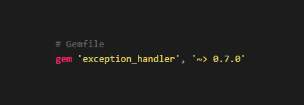

  
  
  
  
  

----------

**ExceptionHandler** helps you can create custom **404 & 500 production error pages** *(adapted from [**1**](https://gist.github.com/wojtha/8433843) & [**2**](http://www.sharagoz.com/posts/1-rolling-your-own-exception-handler-in-rails-3))*.

**ExceptionHandler** is the *only* production-ready custom error page solution for Rails 4 & 5. 

Customize your `404` and `500` error pages to be branded to your application in production.

   

- Keep users informed of errors
- Show polished exception pages
- Maintain your error handling in one place

This is the most feature-rich, stable & effective solution for **custom error pages** in Rails 4 & 5. We're *very* proud:

---

**ExceptionHandler** uses the `config.exceptions_app` to catch errors & send them to our [`exceptions` controller](app/controllers/exception_handler/exception_controller.rb). It then extracts data such as `message`, `details`, `user agent`, & populates our `custom view`, storing it in the db, or sending a notification:

**40x Errors** | **50x Errors**
--- | ---
") | ") 
**layouts/application.html.erb** | **layouts/exception.html.erb** 

Rails exceptions are handled by the [**`ActiveDispatch::ShowExceptions`**](https://github.com/rails/rails/blob/4-0-stable/actionpack/lib/action_dispatch/middleware/show_exceptions.rb) middleware:

This is invoked through the **`config.exceptions_app`** hook, courtesy `environment` files (`application.rb`, `environments/development.rb`, `environments/production.rb`).

Whenever an exception is raised, the `config.exceptions_app` hook is called. This allows you to interject your own code.

Most **custom rails error page** solutions just send exceptions to the routes (MASSIVE bloat). **ExceptionHandler** cuts ALL overhead, dealing directly with the middleware stack. **ExceptionHandler** is the most trustworthy, flexible and stable Rails custom exception handling solution, trusted by over 30,000 users worldwide. 

**ExceptionHandler** gives you a concise, robust way to access all the data of an exception, pushing your app to the next level in branding and usability. There is no other system like this. `ExceptionHandler` is the *only* Rails production exception handling solution, giving you **complete control** over the feel of your application, even when it fails:

----------

- [**Installation**](#installation)
  - [Config](#config)
  - [DB](#db)
  - [Views](#views)
  - [Layout](#layout)
- [**Development**](#testing)
- [**Bugs**](#bugs)
- [**Support**](#support)
  - [Video](#video)
  - [Issue](https://github.com/richpeck/exception_handler/issues)
  - [StackOverflow](http://stackoverflow.com/questions/ask?tags=exception_handler&ruby_on_rails)
- [**Changelog**](#changelog)
  - [0.5.0](#050)
  - [0.4.7](#047)
- [**Contribution**](#contribution)

----------

##  Installation

     gem install 'exception_handler'
 
or 

    gem 'exception_handler', '~> 0.5.0' # Gemfile

 
<a href="https://rubygems.org/gems/exception_handler" style="text-align: center">
  You can see `ExceptionHandler` on RubyGems
   
  
</a>

----------

##### Config

If you wish to change any of the default settings (below), you should now add `config.exception_handler` to your `config/application.rb` or `config/production.rb` file:

**IMPORTANT**

If you're upgrading from `>= 0.4.7`, you need to **remove your `exception_handler` initializer**.

We've changed the load process to use Rails app `config` - **you don't need the `exception_handler` initializer any more** ([more](https://github.com/richpeck/exception_handler/wiki/Setup))

----------

##### DB

If you want to store exceptions in the db, you will need to set up a `migration`:

    $ rails generate exception_handler:migration
    $ rake db:migrate

You will also need to ensure your config `db` option is either `true` || `:table_name`:

----------

##### Views

If you want to change the views, you can have them put into your app:

    $ rails generate exception_handler:views #-> controller, models, helpers, views & assets
	$ rails generate exception_handler:views -v views controllers models helpers assets #-> remove as appropriate to install individual assets

The views will be appended to your app, and you'll be able to edit them as required.

---

##### Show

The view is located in `app/views/exception_handler/show.html.erb` designed to work for all exceptions.

By default, it is split for use with different layouts, data being available to both.

This works exactly the same as the other views in your app (IE the `exceptions` controller invokes the `show` action)

----------

##### Layout

One of the most critial aspects of **ExceptionHandler** is the [custom `Exception` layout](/app/controllers/exception_handler/exception_controller.rb).

If you want to change the layout (for 500 error pages), you need to use the following:

----------

**`Exception Handler`** now supports a rigorous test suite:

---

##### Development

`config.exceptions_app` is only used in Rails' **production** environment.

If you wish to customize in dev, you need to make your app process requests as production. This is a temporary step, and will be resolved in a new version:

You should change this setting if you wish to test your styling in development mode. It should be temporary (you need to change it back once you have it looking how you like)

----------

#### `ApplicationController`

   
   
   A significant issue exists in respect to the inheritance of `exceptions_controller`:
   

   If you use any sort of `before_action` callback in your controller, especially to populate variables, this
   will cause untold problems in your `exceptions_controller`. 

   `500` errors are server faults; trying to get the server to call more data will simply not work. It causes
   an exception loop, leading to catastrophic failure.

#### Routes

If you are using any custom routes in `application` layout, you need to prepend `main_app` to them:

----------

#### 0.5.0
 - Added locales
 - Email notifications
 - Full test suite (finally)
 - Rails 4.2 & Rails 5.0 native ([`request.env`](https://github.com/rails/rails/commit/05934d24aff62d66fc62621aa38dae6456e276be) fix)
 - Controller fixed
 - `DB` fixed
 - Legacy initializer support ([more](https://github.com/richpeck/exception_handler/wiki/Setup))
 - Rails asset management improvement
 - Cut out most dev files from gem (drastic reduction in gem size)

#### 0.4.7

 - New config system ([more](https://github.com/richpeck/exception_handler/wiki/Setup))
 - Fixed controller layout issues
 - Streamlined middleware
 - New layout & interface implementation

----------

#### Video

**Coming Soon**

#### [Issue](https://github.com/richpeck/exception_handler/issues)

**~60 minute response time**

#### [StackOverflow](http://stackoverflow.com/questions/ask?tags=exception-handler+ruby-on-rails) 

**~24 hour response time**

----------

Contributions welcome.

1. Fork it ( https://github.com/richpeck/exception_handler/fork )
2. Create your feature branch (`git checkout -b my-new-feature`)
3. Commit your changes (`git commit -am 'Add some feature'`)
4. Push to the branch (`git push origin my-new-feature`)
5. Create a new Pull Request