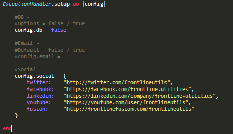

  <strong><a href="#user-content-install">Install</a></strong> - <strong><a href="#user-content-config">Config</a></strong> - <strong><a href="#user-content-support">Support</a></strong>

  
  
  
  
  

----------

**ExceptionHandler** helps you can create custom **404 & 500 production error pages** *(adapted from [**1**](https://gist.github.com/wojtha/8433843) & [**2**](http://www.sharagoz.com/posts/1-rolling-your-own-exception-handler-in-rails-3))*.

**ExceptionHandler** is the *only* production-ready custom error page solution for Rails 4 & 5. 

---

    
  <strong>Customize <i>404</i> and <i>500</i> error pages to be branded to your application in production:</strong>

  &nbsp; <strong>Responsive</strong> &nbsp;
  &nbsp; <strong>Branded Error Pages</strong> &nbsp;
  &nbsp; <strong>Middleware Exception Handling</strong> &nbsp;
  &nbsp; <strong>Fully Customizable</strong> &nbsp;

   
   

The most feature-rich, stable & effective solution for **custom error pages** in Rails 4 & 5.

---

  

  

  &nbsp; <strong>New Controller</strong> &nbsp;
  &nbsp; <strong>New Middleware</strong> &nbsp;
  &nbsp; <strong>Full Test Suite</strong> &nbsp;
  &nbsp; <strong>Rails 4 & 5 Compatible</strong> &nbsp;

Brand new `controller`, `middleware` & options have made **`ExceptionHandler`** even more powerful & efficient. Now you can use `ExceptionHandler` directly with a single click -- **plug and play** custom exception pages

   &nbsp;  &nbsp; 

  
  

**ExceptionHandler** uses `config.exceptions_app` to catch & send errors to the [`exceptions` controller](app/controllers/exception_handler/exception_controller.rb).

It uses data stored in `Rack` (`message`, `details`, `user agent`) to populate its `custom view`. This gives you the ability to **maintain your branding** *even* when your app experiences an exception.

----

   
  
   

The power of **`ExceptionHandler`** lies in its capacity to access the [**`ActiveDispatch::ShowExceptions`**](https://github.com/rails/rails/blob/4-0-stable/actionpack/lib/action_dispatch/middleware/show_exceptions.rb) middleware:

  

Rails invokes [`config.exceptions_app`](http://guides.rubyonrails.org/configuring.html#rails-general-configuration) whenever an exception is raised.

**ExceptionHandler** injects our `ExceptionsController` into this hook to provide the most efficient response:

> **`config.exceptions_app`** sets the exceptions application invoked by the **`ShowException`** middleware when an exception happens. Defaults to **`ActionDispatch::PublicExceptions.new(Rails.public_path)`**.

  

As opposed to other exception suites (which use the `routes`), this gives you DIRECT access to the exception through the middleware stack, straight to the `ExceptionsController`:

   &nbsp;

**ExceptionHandler** uses our [custom middleware](https://github.com/richpeck/exception_handler/blob/0.5/lib/exception_handler/parse.rb) to extract *all* the exception data for the request. Not only is this the most succinct, efficient way to do this, it also allows you to customize the *entire* fault-recovery process.

It's completely unique - the **only** professional solution to catch, process & handle exceptions in Rails.

----------

   
  
   
  <strong>Plug & Play - You Don't Need <i>Any</i> Configuration To Change ExceptionHandler</strong>

    gem install "exception_handler"

    or

    gem 'exception_handler', '~> 0.5.0' #-> Gemfile

`ExceptionHandler`'s new **config** system (introduced in [`0.4.7`](https://github.com/richpeck/exception_handler/wiki/Setup)) stores all the defaults so you don't have to.

----

   
  

**`ExceptionHandler 0.5`** has the SIMPLEST config possible...

  

**`ExceptionHandler`** can be configured to run in different [`environments`](http://guides.rubyonrails.org/configuring.html#creating-rails-environments).

You can apply the above options to the 

> **IMPORTANT**
>
> If you're upgrading from >= `0.4.7`, you need to **remove your `exception_handler` initializer**.
> 
> We've changed the load process to use Rails app config - **you don't need the `exception_handler` initializer any more**

--

#### Defaults

As can be seen in the [`config`](/lib/exception_handler/config.rb) class, the following are all the options `exception_handler` accepts:

    #config/application.rb
    config.exception_handler = {
      dev:    false, #-> defaults to "false" for dev mode
      db:     false, #-> defaults to :errors if true, else input "table_name" as string
      email:  false, #-> need to integrate
      social: {
        :facebook   =>  'frontline.utilities', #-> Facebook handle
        :twitter    =>  'frontlineutils',      #-> Twitter handle
        :youtube    =>  'frontlineutils',      #-> YouTube handle
        :linkedin   =>  'frontline-utilities', #-> LinkedIn handle
        :fusion    =>   'frontlineutils',      #-> Fusion handle
        :url => {                             
          :facebook   =>  'https://facebook.com',          #-> no need to edit
          :twitter    =>  'http://twitter.com',            #-> no need to edit
          :youtube    =>  'https://youtube.com/user',      #-> no need to edit
          :linkedin   =>  'https://linkedin.com/company',  #-> no need to edit
          :fusion     =>  'https://frontlinefusion.com',   #-> no need to edit              
        },
      },
      layouts: {
        '404' => nil, #-> 404 Callback (needs improving big time) Use the following: '404' => <<-EOF redirect_to root_url, notice: "Hello" EOF
        '500' => 'exception'
      }
      '404' => nil #-> gives direction to 404 errors (default loads "show" view of ExceptionsController)
    }

The above are used as ***defaults***.

You have the ability to change any one of the options. 

You can change the options for each `environment` (EG `development` / `production` / `staging`).

--

#### Dev

Want to test?

    #config/application.rb
    config.exception_handler = {
      dev: true # -> Runs in development mode WITHOUT changing the app environment files
    }

`config.exceptions_app` *only* works when you have `config.consider_all_requests_local = false`

If you wish to test in `development`, you'll have to use the `dev: true` option in your `exception_handler` config.

--

#### Layouts

--

#### Views

--

#### DB

If you want to store exceptions in the db, you will need to set up a migration:

    $ rails generate exception_handler:migration
    $ rake db:migrate

You will also need to ensure your config db option is either `true` or `"table_name"`:

  

> **IMPORTANT**
> 
> `ExceptionHandler`'s [new config system](https://github.com/richpeck/exception_handler/wiki/Setup) is `environment` agnostic. 
> 
> **Where you declare your `db` setting will change depending on your environment**
> 
> If you declare `db` in `application.rb`, it will be applicable for all `environments`; only declaring in `production.rb` will set it for production *only*.

----

   
  

Github Issue (1hr) | Stackoverflow (24hrs) | Video (Soon)
:----: | :----: | :----:
 |  | 

--

#### 0.5.1
 - Next release

#### 0.5.0
 - Added locales
 - Email notifications
 - Full test suite (finally)
 - Rails 4.2 & Rails 5.0 native ([`request.env`](https://github.com/rails/rails/commit/05934d24aff62d66fc62621aa38dae6456e276be) fix)
 - Controller fixed
 - `DB` fixed
 - Legacy initializer support ([more](https://github.com/richpeck/exception_handler/wiki/Setup))
 - Rails asset management improvement
 - Cut out most dev files from gem (drastic reduction in gem size)

#### 0.4.7

 - New config system ([more](https://github.com/richpeck/exception_handler/wiki/Setup))
 - Fixed controller layout issues
 - Streamlined middleware
 - New layout & interface implementation

----------

[**FL**](http://frontlineutilities.co.uk)