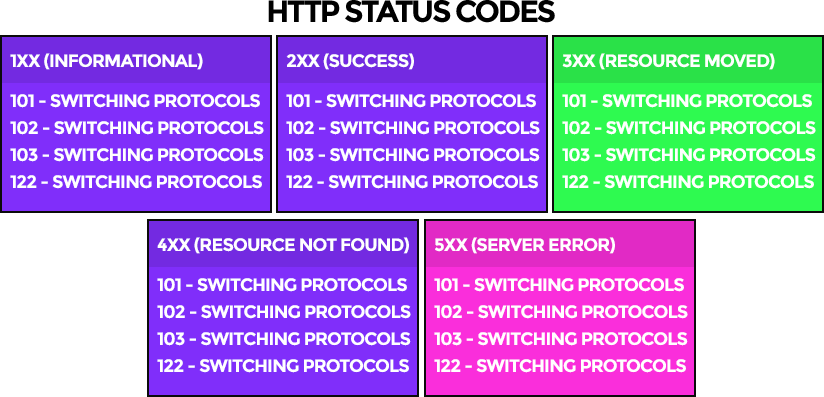

<p align="center">
  <strong>README updated. We've also incorporated it into 💀 <a href="https://www.vpsdeploy.com" title="Custom VPS Deployment For Rails"><u>VPSDeploy.com - VPS Deployment Solution</u></a> 💀 -<br/>Custom Rails Tutorials + Deployment Infrastructure For Cloud VPS Servers...</strong><hr />
</p>


<h3 align="center">
  Custom <code>40x</code> / <code>50x</code> Error Pages For Ruby on Rails
</h3>

<p align="center">
  <strong>
    ⬇️ <b><code>ExceptionHandler</code></b> overrides <a href="http://guides.rubyonrails.org/configuring.html#rails-general-configuration"><code>exceptions_app</code></a> to create <a href="https://medium.com/ruby-on-rails-web-application-development/custom-400-500-error-pages-in-ruby-on-rails-exception-handler-3a04975e4677">custom 40x/50x error pages</a> with your layouts/views ⬇️
  </strong>
</p>

<p align="center">
  <a href="http://badge.fury.io/rb/exception_handler"></a>
  <a href="http://rubygems.org/gems/exception_handler"></a>
  <a href="https://codeclimate.com/github/richpeck/exception_handler"></a>
  <a href="https://gemnasium.com/richpeck/exception_handler"></a>
  <a href='https://coveralls.io/github/richpeck/exception_handler?branch=master'></a>
  <a href="https://travis-ci.org/richpeck/exception_handler"></a>
</p>

<p align="center">
  At version <b><a href="https://github.com/richpeck/exception_handler/releases/tag/v0.8.0.0">0.8.0.0</a></b> - it is now the <b>most popular</b> and <b>easiest-to-use</b> "error pages" gem for Rails 4 & 5...
</p>

<p align="center">
   
   
</p>

<p align="center">
  This <b>README</b> explains how it works
  <br />If you need <b>further support</b>, please email <a href="mailto: rpeck@frontlineutilities.co.uk">rpeck@fl.co.uk</a>...
</p>

---

<p align="center">
  <strong>⌚️ <a href="#-introduction-">Introduction</a> ⌚️</strong> | <strong>✔️ <a href="#install">Installation</a> ✔️</strong> | <strong>🔨 <a href="#config">Setup</a> 🔨</strong> | <strong>☎️ <a href="#support">Support</a> ☎️</strong> | <strong>⭐ <a href="#roadmap">Changelog</a> ⭐</strong>
</p>

---

<p align="center">
  
</p>

<p align="center">
  &nbsp; <strong>Responsive</strong> &nbsp;
  &nbsp; <strong>Branded Error Pages</strong> &nbsp;
  &nbsp; <strong>Middleware Exception Handling</strong> &nbsp;
  &nbsp; <strong>Fully Customizable</strong> &nbsp;
</p>

<p align="center">
   
   
</p>

## ⌚️ Introduction ⌚️
**There are 2️⃣ types of HTTP "error"** → [`40x`][40x] (Client Error) & [`50x`][50x] (Server Error) ↴

<p align="center">
  
</p>

Each time you send a "request" to an Internet-connected computer via HTTP (which is basically how the "web" works), your browser is expecting a *response* to be delivered. This response has a standardized set of attributes, from the ["body"](https://en.wikipedia.org/wiki/HTTP_message_body) to the "status code"

<p align="center">
  
</p>

Whilst only 2 are erroneous, there are **5 types of HTTP status code** - [`10x`][10x], [`20x`][20x], [`30x`][30x], [`40x`][40x], & [`50x`][50x]. Each has their own reason for existing, but what's important is they are ALL used to describe different "responses" that your web browser will have to deal with...  

[[ image - static pages ]]

These responses may differ depending on the web server software. Everything

**`ExceptionHandler`** provides Rails with the ability to serve ***dynamic*** exception pages, built with your own layouts/views. By overriding the <a href="http://guides.rubyonrails.org/configuring.html#rails-general-configuration">`exceptions_app`</a> hook, it provides a custom `controller`, `model` and `views` to display custom error pages. The system is 100% compatible with Rails 4 & 5...

----------

<p align="center">
  [[ Image ]]
</p>

<p align="center">
  <a href="#config"> Config</a>&nbsp;&nbsp;&nbsp;&nbsp;<a href="#dev-mode" title="Dev Mode"> Dev</a>&nbsp;&nbsp;&nbsp;&nbsp;<a href="#database">  Database</a>&nbsp;&nbsp;&nbsp;&nbsp;<a href="#email">  Email</a>&nbsp;&nbsp;&nbsp;&nbsp;<a href="#views">  Views</a>&nbsp;&nbsp;&nbsp;&nbsp;<a href="#locales">  Locales</a>&nbsp;&nbsp;&nbsp;&nbsp;<a href="#custom-exceptions">  Custom Exceptions</a>&nbsp;&nbsp;&nbsp;&nbsp;<a href="#generators">  Generators</a>
</p>

<p align="center">
  -- <br />
  <code>ExceptionHandler</code> works by adding a <code>controller</code> to your app.<br />This controller is called each time an "error" is raised inside your application.
</p>

----

## 🚧 Config 🚧

`ExceptionHandler` works straight out of the box in **Production/Staging (NON development)** environments...

[[ image ]]

In development, Rails uses its own "error" handling process, and thus `ExceptionHandler` is not required (unless you override the [`consider_all_requests_local`](http://guides.rubyonrails.org/configuring.html#rails-general-configuration) option - which we've already done with [`dev`](#dev-mode)).

**There are 5️⃣ options within `ExceptionHandler`** → [`dev`](#dev-mode), [`db`](#database), [`email`](#email), [`social`](views), [`layouts`](#layouts).

If you want to change any of them - you need to provide an options block in your Rails config files (`/config/application.rb` / `/config/environments/[env].rb`).

Your config block is then *merged* with the gem's defaults at boot, meaning that it does not matter how you define the options - they'll always be added to the gem's internal configuration (if they're valid).

Whilst you could use an initializer, we felt it more efficient to just use a "config" block, like 99% of other Rails integrations. It also means you're able to easily migrate the gem to other apps without having to copy your entire config file stack...

```
###########################
# => config/application.rb
###########################

config.exception_handler = {
  dev:   nil, # => allows you to turn ExceptionHandler "on" in development
  db:    nil, # => allocates a "table name" into which exceptions are saved (defaults to :errors)
  email: nil, # => sends exception emails to a listed email (string // "you@email.com"),
  social: {   # => on the 50x error page, we've included social media links
    facebook: nil, # => Facebook page name   
    twitter:  nil, # => Twitter handle  
    youtube:  nil, # => Youtube channel name / ID
    linkedin: nil, # => LinkedIn name
    fusion:   nil  # => FrontlineFusion handle
  },  
  layouts: {  # => There are two layouts - 40x & 50x
    # => whenever you define the
    500 => "exception",
    501 => "exception",
    502 => "exception",
    503 => "exception",
    504 => "exception",
    505 => "exception",
    507 => "exception",
    510 => "exception"
  }
}

```  

If you're using an [`engine`](http://guides.rubyonrails.org/engines.html), you don't need to use an `initializer`:

    # lib/engine.rb
    module YourModule
      class Engine < Rails::Engine

        # => ExceptionHandler
        # => Works in and out of an initializer
        config.exception_handler = {
          dev: nil, # => this will not load the gem in development
          db:  true # => this will use the :errors table to store exceptions
        }
      end

    end

The best thing about using a `config` options block is that you are able to only define the options that you require. This means that if you have particular options you *only* wish to run in `staging`, or have single options for `production` etc...  

    # config/application.rb
    config.exception_handler = { dev: true }

    # config/environments/production.rb
    config.exception_handler = { social: { fusion: "flutils" }}

----

## 💻 Dev Mode 💻

As explained, `ExceptionHandler` does not work in `development` by default.

This is because it overrides the `exceptions_app` middleware hook - which is only invoked in the `production` or `staging` environments.

To get it working in `development`, you will need to override the [`config.consider_all_requests_local`](http://guides.rubyonrails.org/configuring.html#rails-general-configuration) setting (which is a standard component of Rails) ↴

<p align="center">
  
</p>

This is normally done by just changing the setting in your Rails config files. However, to make the process simpler for `ExceptionHandler`- we've added a `dev` option which allows you to essentially override the hook through the context of ExceptionHandler...

```
# config/application.rb
config.exception_handler = { dev: true }

```

This disables [`config.consider_all_requests_local`](http://guides.rubyonrails.org/configuring.html#rails-general-configuration), making Rails behave as it would in production:

![Dev][dev_img]

Obviusly, this has other connotations including the likes of making your requests g thrugh yur prduction server etc. For the time being, it's the most effective way to get `ExceptionHandler` working

----

## Database

**We also have `ActiveRecord` integration.**

If you want to save your exceptions to `db`, you need to enable the `db` config option:

    # config/application.rb
    config.exception_handler = {
      db: true
    }

This enables `ActiveRecord::Base` on the [`Exception`](app/models/exception_handler/exception.rb) class, allowing us to save to the database.

In order for this to work, your db needs the correct table.

To do this, once you've enabled the option, run `rails db:migrate` from your console. Our new [`migration system`](https://github.com/richpeck/exception_handler/tree/readme#migrations) will automatically run the migration.

---

## Email

**`ExceptionHandler` also now sends email notifications.**

If you want to receive emails whenever your application raises an error, you can do so by adding your email to the config:

    # config/application.rb
    config.exception_handler = {
      email: "your@email.com"
    }

> **Please Note** this requires [`ActionMailer`](http://guides.rubyonrails.org/action_mailer_basics.html). If you don't have any outbound SMTP server, [`SendGrid`](http://sendgrid.com) is free.

[Full tutorial here](https://github.com/richpeck/exception_handler/wiki/2-Email)

---

## Views

**From [`0.7.0`](#070), we overhauled the view system:**

![View][view_img]

[Wiew](app/views/exception_handler/exceptions/show.html.erb) is modular - `@exception` populated with [`locales`](#locales).

---

## Locales

**[`0.7.5`](https://github.com/richpeck/exception_handler/releases/tag/0.7.5) introduced [locales](config/locales/exception_handler.yml) ...**

[[ locales ]]

The `ExceptionHandler` view is populated by [`@exception.description`](app/models/exception_handler/exception.rb#L121), which pulls from the `locales`.

If you want custom messages, you need the following. The key is defined by the HTTP [`status_code`](https://github.com/rack/rack/blob/1.5.2/lib/rack/utils.rb#L544)

    # config/locales/en.yml
    en:
      exception_handler:
        not_found: "Your message here"
        unauthorized: "You need to login to continue"
        internal_server_error: "This is a test to show the %{status} of the error"

You get access to `%{message}` and `%{status}`, both inferring from `@exception`.

---

## Layout

**The `layout` has also been improved ↴**

![Layout][layout_img]

We now assign layouts to the **status code** of the response:

![Layout][layouts_img]

By default, `5xx` errors are shown with our [`exception` layout][layout] - this can be overridden by changing the `config` to use a layout of your choice. If you want to inherit the `ApplicationController` layout, assign the codes to `nil`.

---


## Custom Exceptions

**Custom Exceptions also supported in [`0.7.5`](https://github.com/richpeck/exception_handler/releases/tag/0.7.5)**

Rails handles this for us - [**`config.action_dispatch.rescue_responses`**][rescue_responses]  ↴

![ActionDispatch][config.action_dispatch.rescue_responses]

You need to add to the `rescue_responses` hash in your app's config (mapped to [`status codes`](https://github.com/rack/rack/blob/1.5.2/lib/rack/utils.rb#L544)):

    # config/application.rb
    config.action_dispatch.rescue_responses["ActionController::YourError"] = :bad_request

Because `HTTP` can only process `4xx` / `5xx` errors, if `Rails` raises an exception, it needs to assign one of the error status codes. **Default** is [`internal_server_error`](https://github.com/rack/rack/blob/1.5.2/lib/rack/utils.rb#L595) - if you'd prefer your app to just return `500` errors for your custom exception, you don't need to explicitly declare them.

---

## Generators

**You can generate `ExceptionHandler` into your own application.**

[[ Generator ]]

The following commands will copy the directories...

    rails g exception_handler:views
    rails g exception_handler:views -v views
    rails g exception_handler:views -v controllers
    rails g exception_handler:views -v models
    rails g exception_handler:views -v assets
    rails g exception_handler:views -v views controllers models assets

If you don't include any switches, this will copy **all** the folders put into your app.

Each switch defines which folders you want (EG `-v views` will only copy `views` dir).

---

### Migrations (deprecated)

**From [`0.7.5`](https://github.com/richpeck/exception_handler/releases/tag/0.7.5), the `migration` generator has been removed in favour of our own [migration system](lib/exception_handler/engine.rb#L58)**

You don't need to generate a migration any more.

If you set the `db` option in config, run `rails db:migrate` and the migration will be run.

To rollback, use the following:

    rails db:migrate:down VERSION=000000

> The drawback to this is that if you remove `ExceptionHandler` before you rollback the migration, it won't exist anymore. You can **only** fire the `rollback` when you have `ExceptionHandler` installed.

---

## Support

You're welcome to access our [Issues](https://github.com/richpeck/exception_handler/issues) page to contact us directly. Alternatively, you could use [StackOverflow](https://github.com/richpeck/exception_handler/issues):

 - [Issues](https://github.com/richpeck/exception_handler/issues)
 - [StackOverflow](https://github.com/richpeck/exception_handler/issues)
 - [Email](mailto:rpeck@fl.co.uk)

---

## Changelog

### 🏹 0.8.0.0
 - [x] README
 - [x] Locales for 400/500 errors
 - [x] Email improvement
 - [x] Streamlined migration etc

### 👽 0.7.5.0
 - [x] [HTTP status layouts](#layouts)

### ⚡ 0.7.0.0
 - [x] Wildcard mime types
 - [x] [Custom exceptions](#custom_exceptions)
 - [x] Test suite integration
 - [x] [Email](#email)
 - [x] [Model backend](#database)
 - [x] Sprockets 4+
 - [x] New layout
 - [x] Readme / wiki overhaul

### Ⓜ️ 0.6.5.0
 - [x] Streamlined interface
 - [x] ActiveRecord / Middleware overhaul
 - [x] Supports Sprockets 4+ ([`manifest.js`](http://eileencodes.com/posts/the-sprockets-4-manifest/))
 - [x] Email integration
 - [x] Asset overhaul & improvement
 - [x] Removed dependencies

### ✔️ 0.5.0.0
 - [x] Locales
 - [x] Email notifications
 - [x] Full test suite
 - [x] Rails 4.2 & Rails 5.0 native ([`request.env`](https://github.com/rails/rails/commit/05934d24aff62d66fc62621aa38dae6456e276be) fix)
 - [x] Controller fixed
 - [x] `DB` fixed
 - [x] Legacy initializer support ([more](https://github.com/richpeck/exception_handler/wiki/1-Setup))
 - [x] Rails asset management improvement
 - [x] Reduced gem file size

### ⭕ 0.4.7.0
 - [x] New config system
 - [x] Fixed controller layout issues
 - [x] Streamlined middleware
 - [x] New layout & interface

----

[![404 + 500 Errors][banner]][rubygems]

<p align="center">
  <strong><a href="#">`ExceptionHandler`</a> is now the LEADING error pages gem for Rails 4 & 5</strong>
  <br />
  No other gem is as simple or effective at providing beautiful exception pages in production...
</p>

<p align="center">
  <a href="http://badge.fury.io/rb/exception_handler"></a>
  <a href="http://rubygems.org/gems/exception_handler"></a>
  <a href="https://codeclimate.com/github/richpeck/exception_handler"></a>
  <a href="https://gemnasium.com/richpeck/exception_handler"></a>
  <a href='https://coveralls.io/github/richpeck/exception_handler?branch=master'></a>
  <a href="https://travis-ci.org/richpeck/exception_handler"></a>
</p>

<p align="center">
  <strong>➡️ <a href="https://rubygems.org/gems/exception_handler">Download</a> ⬅️ </strong>
</p>

----------

:copyright: <a href="http://www.frontlineutilities.co.uk" align="absmiddle" ></a> <a href="http://stackoverflow.com/users/1143732/richard-peck?tab=profile" align="absmiddle" ></a>

<!-- ################################### -->
<!-- ################################### -->

<!-- Refs -->
<!-- Comments http://stackoverflow.com/a/20885980/1143732 -->
<!-- Images   https://github.com/adam-p/markdown-here/wiki/Markdown-Cheatsheet#images -->

<!-- Images -->
[dev_mode]:         readme/dev_mode.jpg
[dev_img]:          readme/dev.png
[layouts_img]:      readme/layouts.jpg
[layout_img]:       readme/layout.png
[view_img]:         readme/view.jpg
[http_codes]:       readme/http_codes.png
[config]:           readme/config.jpg
[config.action_dispatch.rescue_responses]: readme/config.action_dispatch.rescue_responses.jpg
[banner]:           readme/banner.jpg
[gem]:              readme/gem.jpg
[gemfile]:          readme/gemfile.jpg
[middleware]:       readme/middleware.jpg
[exceptions_app]:   readme/exceptions_app.jpg
[view]:             readme/titles/view.jpg
[dev]:              readme/titles/dev.jpg
[db]:               readme/titles/db.png
[support]:          readme/titles/support.png "Support"
[changelog]:        readme/titles/changelog.png "Changelog"
[contribution]:     readme/titles/contributions.png "Contributions"
[fl]:               readme/fl.jpg "Frontline Utilities LTD"
[profile]:          https://avatars0.githubusercontent.com/u/1104431 "R Peck"

<!-- Links -->
[better_errors]: https://github.com/charliesome/better_errors
[layout]: app/views/layouts/exception.html.erb
[status_codes]: http://guides.rubyonrails.org/layouts_and_rendering.html#the-status-option
[stackoverflow]: http://stackoverflow.com/questions/ask?tags=ruby-on-rails+exception-handler
[rescue_responses]: http://guides.rubyonrails.org/configuring.html#configuring-action-dispatch
[latest]: https://github.com/richpeck/exception_handler/releases/latest
[show_exception]: https://github.com/rails/rails/blob/4-0-stable/actionpack/lib/action_dispatch/middleware/show_exceptions.rb
[exception_app]: http://guides.rubyonrails.org/configuring.html#rails-general-configuration
[rubygems]: http://rubygems.org/gems/exception_handler
[frontlineutilities.co.uk]: http://www.frontlineutilities.co.uk
[stackoverflow.com]: http://stackoverflow.com/users/1143732/richard-peck?tab=profile
[fork]: #fork-destination-box
[pull]:  http://github.com/richpeck/exception_handler/pulls
[issues]: http://github.com/richpeck/exception_handler/issues

[10x]: https://en.wikipedia.org/wiki/List_of_HTTP_status_codes#1xx_Informational_responses
[20x]: https://en.wikipedia.org/wiki/List_of_HTTP_status_codes#2xx_Success
[30x]: https://en.wikipedia.org/wiki/List_of_HTTP_status_codes#3xx_Redirection
[40x]: https://en.wikipedia.org/wiki/List_of_HTTP_status_codes#4xx_Client_errors
[50x]: https://en.wikipedia.org/wiki/List_of_HTTP_status_codes#5xx_Server_errors

<!-- ################################### -->
<!-- ################################### -->
