

  <strong>Custom 404 & 500 production error pages for Rails 4 & 5.</strong>

  
  
  
  
  
  

  <strong><a href="#user-content-install">Install</a></strong> → <strong><a href="#user-content-config">Setup</a></strong> → <strong><a href="#user-content-support">Support</a></strong>

---

   

  &nbsp; <strong>Responsive</strong> &nbsp;
  &nbsp; <strong>Branded Error Pages</strong> &nbsp;
  &nbsp; <strong>Middleware Exception Handling</strong> &nbsp;
  &nbsp; <strong>Fully Customizable</strong> &nbsp;

   
   

---

  

  

  &nbsp; <strong>New Controller</strong> &nbsp;
  &nbsp; <strong>New Middleware</strong> &nbsp;
  &nbsp; <strong>Full Test Suite</strong> &nbsp;
  &nbsp; <strong>FULLY Rails 4 & 5 Compatible</strong> &nbsp;

Brand new `controller`, `middleware` & options have made **`ExceptionHandler`** even more powerful & efficient. Now you can use `ExceptionHandler` directly with a single click -- **plug and play** custom exception pages:

  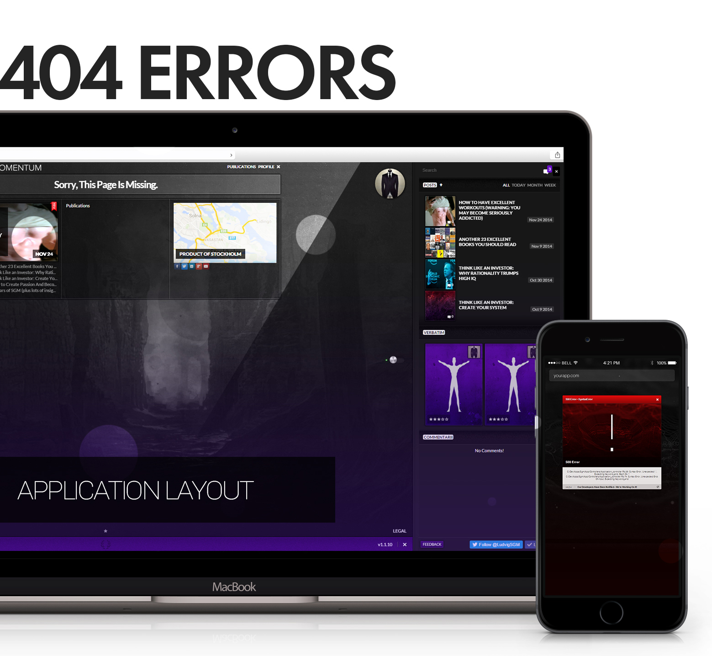
  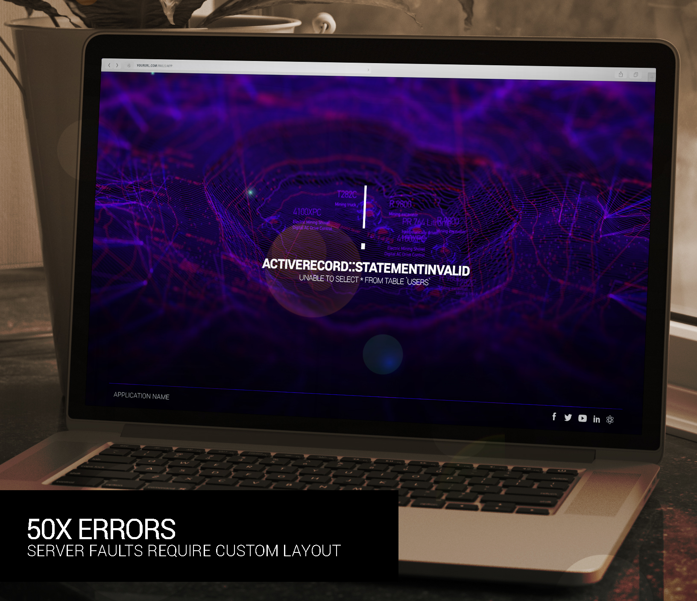

**ExceptionHandler** uses `config.exceptions_app` to catch & send errors to the [`exceptions` controller](app/controllers/exception_handler/exception_controller.rb).

It uses data stored in `Rack` (`message`, `details`, `user agent`) to populate its `custom view`. This gives you the ability to **maintain your branding** *even* when your app experiences an exception.

----

   
  
   

The power of **`ExceptionHandler`** lies in its capacity to access the [**`ActiveDispatch::ShowExceptions`**](https://github.com/rails/rails/blob/4-0-stable/actionpack/lib/action_dispatch/middleware/show_exceptions.rb) middleware:

  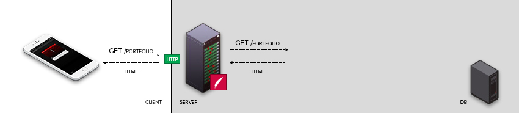

Rails invokes [`config.exceptions_app`](http://guides.rubyonrails.org/configuring.html#rails-general-configuration) whenever an exception is raised.

**ExceptionHandler** injects our `ExceptionController` into this hook to provide the most efficient response:

> **`config.exceptions_app`** sets the exceptions application invoked by the **`ShowException`** middleware when an exception happens. Defaults to **`ActionDispatch::PublicExceptions.new(Rails.public_path)`**.

  

As opposed to other exception suites (which use the `routes`), this gives you DIRECT access to the exception through the middleware stack, straight to the [`ExceptionController`](/app/controllers/exception_handler/exception_controller.rb):

  

**ExceptionHandler** uses [custom middleware](https://github.com/richpeck/exception_handler/blob/0.5/lib/exception_handler/parse.rb) to extract *all* the exception data for the request. Not only is this the most succinct, efficient way to do this, it also allows you to customize the *entire* fault-recovery process.

It's completely unique - the **only** professional solution to catch, process & handle exceptions in Rails.

----------

   
  
   
  <strong>You Don't Need <i>Any</i> Configuration To Run ExceptionHandler</strong>

    gem install "exception_handler"

or

    # Gemfile
    gem 'exception_handler', '~> 0.6.5'

`ExceptionHandler`'s new **config** system (introduced in [`0.4.7`](https://github.com/richpeck/exception_handler/wiki/Setup)) stores all the [defaults](#user-content-defaults) - you just need to install the gem & let it run.

If you want to change *any* settings (detailed [below](#user-content-config)), you **simply** need to change `config/application.rb` / `config/environments/your_env.rb`. The ***POWER*** of this *new config system* means you're able to deploy `ExceptionHandler` in the most unobtrusive, versatile way possible.

  <a href="http://rubygems.org/gems/exception_handler" target="_blank">
    
     
  </a>

----

  
 
  
  
  
  

--

**`ExceptionHandler 0.6.5`** has *drastically* improved our famous 1-click install.

Not only have we removed all the bloat, but our initialization process now relies on a *single* hook which will set all the config variables as required. This is stark difference to the myriad of poorly-designed gems which cause massive lag in your Rails initialization process. `ExceptionHandler` is now more streamlined than ever:

  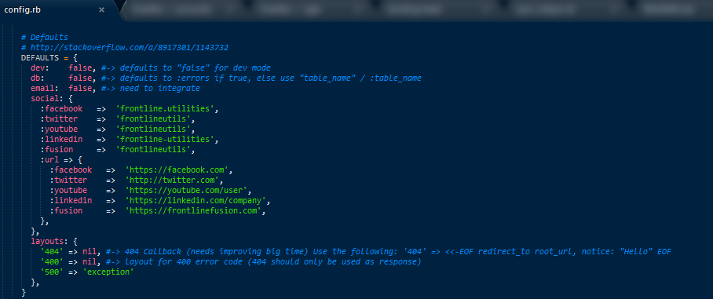

The **MAGIC** lies in the [`environment files`](http://guides.rubyonrails.org/configuring.html#creating-rails-environments).

Instead of dopey initializers (which slow the system down), you can just use the Rails config files to set environment-dependent options. This allows us to maximize performance without any of the overhead associated with old-fashioned gems.

> **IMPORTANT**
>
> If you're upgrading from >= `0.4.7`, you need to **remove your `exception_handler` initializer**.
>
> We've changed the load process to use Rails app config - **you don't need the `exception_handler` initializer any more**

----

  

As can be seen in[`config`](/lib/exception_handler/config.rb), the following are all the options `ExceptionHandler` accepts:

  

    # Defaults
    DEFAULTS = {
      dev: 	  false, #-> defaults to "false" for dev mode
      db:     false, #-> defaults to :errors if true, else use "table_name" / :table_name
      email: 	false, #-> requires string email and ActionMailer
      social: {
        facebook: { name: "frontline.utilities", url: "https://facebook.com" },
        twitter:  { name: "frontlineutils",      url: "http://twitter.com" },
        youtube:  { name: "frontlineutils",      url: "https://youtube.com/user" },
        linkedin: { name: "frontline-utilities", url: "https://linkedin.com/company" },
        fusion:   { name: "flutils",             url: "https://frontlinefusion.com" }
      },
      layouts: {
        "400" => nil,         # => inherits from "ApplicationController" layout
        "500" => "exception"
      },
    }

You can apply any of the above defaults into one of the Rails [`environment files`](http://guides.rubyonrails.org/configuring.html#creating-rails-environments):

- `config/application.rb`
- `config/environments/development.rb`
- `config/environments/production.rb`
- `config/environments/staging.rb`

The benefit of this is that it gives you the ability to customize `ExceptionHandler` for *any* of your environments. Contrary to a shitty `initializer`, you're able to sculpt the gem to work for YOU.

----

  

Want to test in the `dev` environment?

    #config/application.rb
    config.exception_handler = {
      dev: true # -> Runs in development mode WITHOUT changing the app environment files
    }

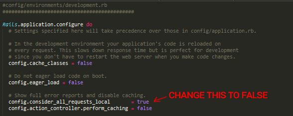

[`config.exceptions_app`](http://guides.rubyonrails.org/configuring.html#rails-general-configuration) *only* works when you have [`config.consider_all_requests_local = true`](http://blog.bigbinary.com/2009/02/05/rescue_action_in_public-local_request-and-how-to-configure-local_request.html), which is `true` in `development`:

> **`config.consider_all_requests_local`** is a flag. If true then any error will cause detailed debugging information to be dumped in the `HTTP` response, and the `Rails::Info controller` will show the application runtime context in `/rails/info/properties`. `True` by default in development and test environments, and false in production mode. For finer-grained control, set this to false and implement `local_request?` in controllers to specify which requests should provide debugging information on errors.

If you wish to test **`ExceptionHandler`** in `development`, you'll have to use the `dev: true` option in your `exception_handler` config, *or* change `config.consider_all_requests_local = true` in `config/development.rb`.

----

 

One of the most critial aspects of **`ExceptionHandler`** is the custom `Exception` layout.

If you want to change the layout (for `500` error pages), you need to use the following:

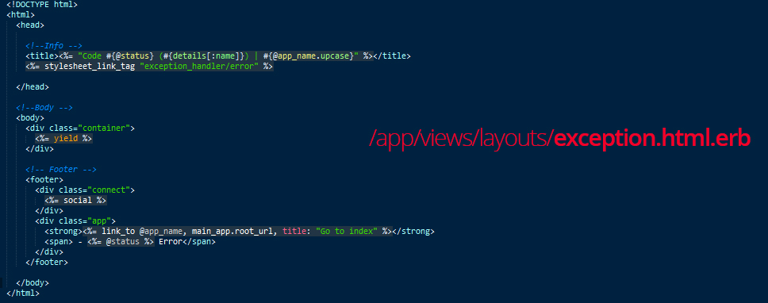

You'll need to [generate](#user-content-view) it into your application before being able to edit:

----

 

**`ExceptionHandler`** comes with its own inbuilt views & controller.

If you want to change it, you need to add the views into your app with the [`generator`](/lib/generators/exception_handler/views_generator.rb)

    $ rails generate exception_handler:views                                            #-> controller, models, helpers, views & assets
    $ rails generate exception_handler:views -v views controllers models helpers assets #-> remove as appropriate to install individual assets

--

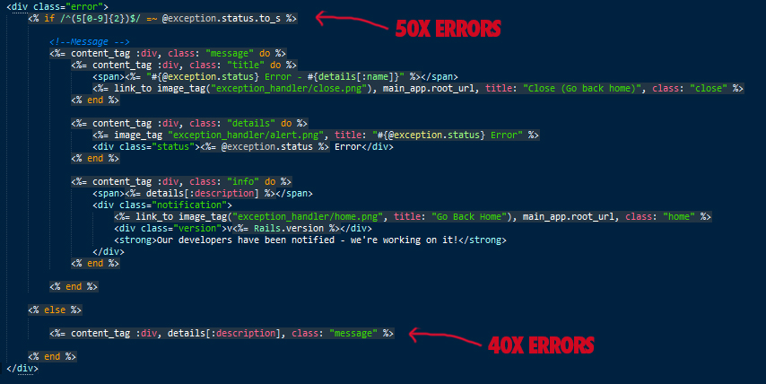

`ExceptionHandler` uses `exceptions#show` -- located in **`app/views/exception_handler/show.html.erb`** designed to work for all exceptions.

By default, it is split for use with different layouts, data being available to both.

This works exactly the same as the other views in your app (IE the `exceptions controller` invokes the `show` action)

----

 

If you want to store exceptions in your `db`, you will need to set up a **migration**:

    $ rails generate exception_handler:migration
    $ rake db:migrate

You will also need to ensure your config db option is either `true` or `"table_name"`:

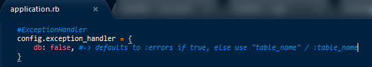

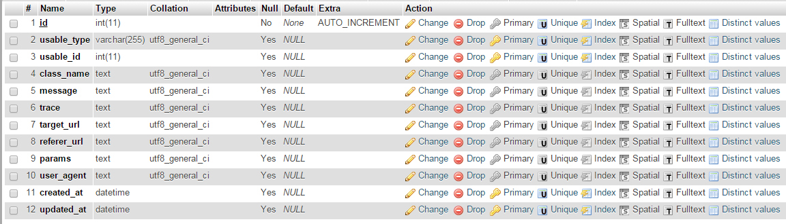

> **IMPORTANT**
>
> `ExceptionHandler`'s [new config system](https://github.com/richpeck/exception_handler/wiki/Setup) is `environment` agnostic.
>
> **Where you declare your `db` setting will change depending on your environment**
>
> If you declare `db` in `application.rb`, it will be applicable for all `environments`; only declaring in `production.rb` will set it for production *only*.

----

  

We offer support through [GitHub](http://github.com/richpeck/exception_handler/issues) and [StackOverflow](http://stackoverflow.com/questions/ask?tags=ruby-on-rails+exception-handler).

Whilst we can't guarantee response times, we are always eager to make sure `ExceptionHandler` is the most secure, robust and effective solution for Rails exception pages. You can use the links below to access support directly:

Github (~1hr) | Stackoverflow (~24hrs)
:----: | :----:
[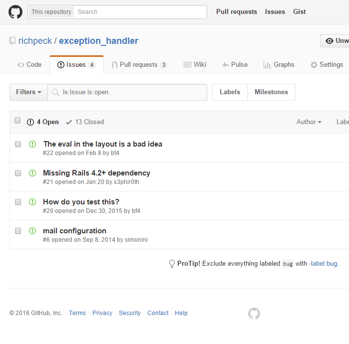](https://github.com/richpeck/exception_handler/issues) | [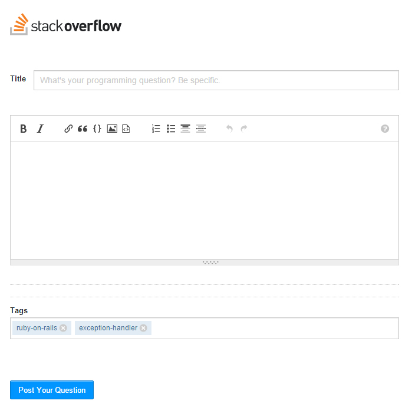](http://stackoverflow.com/questions/ask?tags=ruby-on-rails+exception-handler)

We use **`ExceptionHandler`** in production, so have a vested interest in keeping it running smoothly.

---

The next version will be **`0.7.0`**. Current is **`0.6.5`**.

Functionality remains consistent with both releases, the main difference will be the way in which they handle backend processes. **`0.6.5`** completely overhauled the backend, making the `controller`, `model` and `middleware` much more streamlined.

The biggest update for **`0.6.5.`** has been the removal of most of the middleware, putting the entire system into a central class. This not only allows us to centralize the data structure, but also remove many files which didn't matter.

Here is a rundown of what to expect ...

### → 0.7.0
 - Completely new style
 - Custom exceptions
 - Test suite integration
 - Full readme / wiki overhaul

### → 0.6.5
 - Streamlined interface
 - ActiveRecord / Middleware overhaul
 - Supports Sprockets 4+ ([`manifest.js`](http://eileencodes.com/posts/the-sprockets-4-manifest/))
 - Email integration
 - Asset overhaul & improvement
 - Removed dependencies

### → 0.5.0
 - Added locales
 - Email notifications
 - Full test suite
 - Rails 4.2 & Rails 5.0 native ([`request.env`](https://github.com/rails/rails/commit/05934d24aff62d66fc62621aa38dae6456e276be) fix)
 - Controller fixed
 - `DB` fixed
 - Legacy initializer support ([more](https://github.com/richpeck/exception_handler/wiki/1-Setup))
 - Rails asset management improvement
 - Reduced gem file

### → 0.4.7

 - New config system ([more](https://github.com/richpeck/exception_handler/wiki/1-Setup))
 - Fixed controller layout issues
 - Streamlined middleware
 - New layout & interface implementation

----------

&copy; 2016 [**Richard Peck**](http://stackoverflow.com/users/1143732/richard-peck) for 
