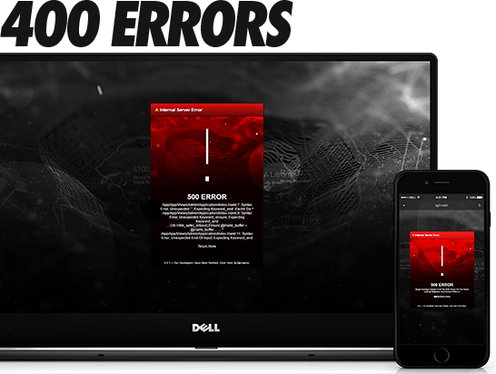
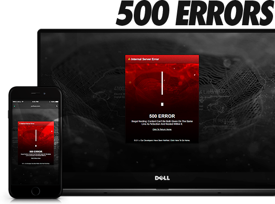
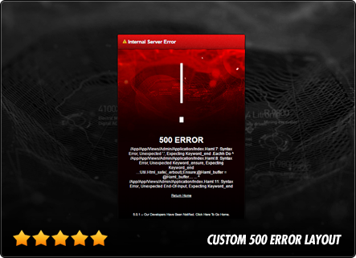
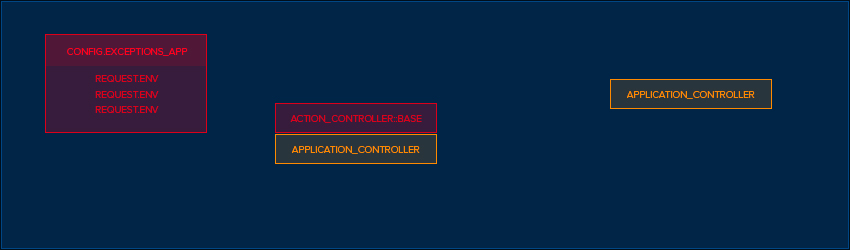

  <strong>Custom 404 & 500 production error pages for Rails 4 & 5.</strong>

  
  
  
  
  
  

  <strong><a href="#user-content-install">Install</a></strong> → <strong><a href="#user-content-config">Setup</a></strong> → <strong><a href="#user-content-support">Support</a></strong>

---

   

  &nbsp; <strong>Responsive</strong> &nbsp;
  &nbsp; <strong>Branded Error Pages</strong> &nbsp;
  &nbsp; <strong>Middleware Exception Handling</strong> &nbsp;
  &nbsp; <strong>Fully Customizable</strong> &nbsp;

   
   

---

  

  

  &nbsp; <strong align="absmiddle">New Controller</strong> &nbsp;
  &nbsp; <strong align="absmiddle">New Middleware</strong> &nbsp;
  &nbsp; <strong align="absmiddle">Full Test Suite</strong> &nbsp;
  &nbsp; <strong align="absmiddle">Fully Rails 4 & 5 Compatible</strong> &nbsp;

Brand new `controller` & `middleware` have made **`ExceptionHandler`** even more powerful & efficient. Now you can use `ExceptionHandler` with a single click → **plug and play** custom exception pages:

   
  
  

  With major upgrades to the backend, <strong>ExceptionHandler <a href="https://github.com/richpeck/exception_handler/releases/latest">latest</a></strong> is the leading exception management solution for Rails 5:

  <h3>Features</h3>
   || DB || Model || Config || Email || 400 Default Layout || Sprockets 4 || Custom Exceptions

**100% works with Rails 5 and Sprockets 4**.

It hooks DIRECTLY into your existing CSS to create a professional exception interface with NO work on your part…

----

  

The secret lies in [**`config.exceptions_app`**][exception_app] ↴

![Exceptions handled by the ActiveDispatch::ShowExceptions Middleware][middleware]

All Rails exceptions are handled with the `config.exceptions_app` callback. This is assigned in the `config/application.rb` or `config/environments/*.rb files` - it needs to be a callback:

![config.exceptions_app][config.exceptions_app]

Every time Rails raises an exception, the [`ShowExceptions`][show_exception] middleware takes the request and forwards it to the `exceptions_app` hook. This hook is expected to return a response; which response is up to you:

![config.exceptions_app - The key to all Rails exceptions][exceptions_app]

`ExceptionHandler` injects our [controller](app/controllers/exception_handler/exceptions_controller.rb) into `exceptions_app`, meaning **`requests`** are handled directly (`message`, `details`, `user agent`). `ExceptionHandler` populates our custom `view` with any details required, giving us the ability to **maintain branding** (layout / css) even when exceptions are raised:

![Exceptions handled by the ActiveDispatch::ShowExceptions Middleware][middleware]

This means `ExceptionHandler` has absolutely ZERO bloat. Rails is invoked ONCE (not twice like it is when using routes), delivering a response JUST LIKE if an exception wasn't raised.

  <strong>The <i>ONLY</i> professional solution to catch, process & handle Rails exceptions <i>WITHOUT</i> BLOAT:</strong>

  

The REAL beauty of ExceptionHandler is that you only have to serve **two** error responses → `400` & `500`. This is per the [HTTP spec](https://www.w3.org/Protocols/rfc2616/rfc2616-sec10.html#sec10.4) - a browser CANNOT read any other form of error.

This means that we can use a single controller action to build our `@exception` object, responding to the HTTP request with the status code raised by the exception. We have built this into a simple & effective solution:

----------

   
  

[![Gemfile][gemfile]][rubygems] [![Gem][gem]][rubygems]

`ExceptionHandler`'s **config** system stores the - you just need to install the gem & let it run.

If you want to change *any* settings (detailed [below](#user-content-config)), you **simply** need to change `config/application.rb` or `config/environments/your_env.rb`. The ***POWER*** of this *new config system* means you're able to deploy `ExceptionHandler` in the most unobtrusive, versatile way possible:

----

## Config

## Database

## Email

--

## Custom Exceptions

Custom exceptions are handled by [`config.action_dispatch.rescue_responses`][rescue_responses]:

> **UPDATE** - `0.7.5` will completely rework the layout engine for  individual HTTP status codes.

---
## Support

We use `ExceptionHandler` in production, so it's imperative for us to keep it working properly.

We have two avenues for support: [StackOverflow][stackoverflow] and [Github Issues](https://github.com/richpeck/exception_handler/issues) - we respond to both as quickly as possible.

---

**Current stable is [`0.7.0`](https://github.com/richpeck/exception_handler/releases/latest)**

Functionality remains consistent with previous releases.

Main difference with `0.7.0` is the way we have overhauled the backend. By introducing a class and several other options, the system is able to run much smoother than before. 99% of bloat has been removed:

### [0.7.5](https://github.com/richpeck/exception_handler/releases/tag/0.7.5)
 - [ ] HTTP-based layouts
 - [ ] Custom exception mapping

### [0.7.0](https://github.com/richpeck/exception_handler/releases/tag/0.7.0)
 - [x] Wildcard mime types
 - [x] [Custom exceptions](#custom_exceptions)
 - [x] Test suite integration
 - [x] [Email](#email)
 - [x] [Model backend](#database)
 - [x] Sprockets 4+
 - [x] New layout
 - [x] Readme / wiki overhaul

### [0.6.5](https://github.com/richpeck/exception_handler/releases/tag/0.6.5)
 - [x] Streamlined interface
 - [x] ActiveRecord / Middleware overhaul
 - [x] Supports Sprockets 4+ ([`manifest.js`](http://eileencodes.com/posts/the-sprockets-4-manifest/))
 - [x] Email integration
 - [x] Asset overhaul & improvement
 - [x] Removed dependencies

### [0.5.0](https://github.com/richpeck/exception_handler/releases/tag/0.5.0)
 - [x] Locales
 - [x] Email notifications
 - [x] Full test suite
 - [x] Rails 4.2 & Rails 5.0 native ([`request.env`](https://github.com/rails/rails/commit/05934d24aff62d66fc62621aa38dae6456e276be) fix)
 - [x] Controller fixed
 - [x] `DB` fixed
 - [x] Legacy initializer support ([more](https://github.com/richpeck/exception_handler/wiki/1-Setup))
 - [x] Rails asset management improvement
 - [x] Reduced gem file size

### [0.4.7](https://github.com/richpeck/exception_handler/releases/tag/0.4.6)
 - [x] New config system
 - [x] Fixed controller layout issues
 - [x] Streamlined middleware
 - [x] New layout & interface implementation

----------
![404 + 500 Errors][banner]

  <strong>[`ExceptionHandler`](#) is now the leading custom error pages gem for Rails.</strong>
   
  No other gem is as simple or effective at providing beautiful exception pages in production.

----------

:copyright:  

<!-- ################################### -->
<!-- ################################### -->

<!-- Refs -->
<!-- Comments http://stackoverflow.com/a/20885980/1143732 -->
<!-- Images   https://github.com/adam-p/markdown-here/wiki/Markdown-Cheatsheet#images -->

<!-- Images -->
[banner]:           readme/banner.png
[config.exceptions_app]: readme/config.exceptions_app.jpg
[gem]:              readme/gem.jpg
[gemfile]:          readme/gemfile.jpg
[middleware]:       readme/middleware.jpg
[exceptions_app]:   readme/exceptions_app.jpg
[view]:             readme/titles/view.jpg
[dev]:              readme/titles/dev.jpg
[db]:               readme/titles/db.png
[support]:          readme/titles/support.png "Support"
[changelog]:        readme/titles/changelog.png "Changelog"
[contribution]:     readme/titles/contributions.png "Contributions"
[fl]:               readme/fl.jpg "Frontline Utilities LTD"
[profile]:          https://avatars0.githubusercontent.com/u/1104431 "R Peck"

<!-- Links -->
[stackoverflow]: http://stackoverflow.com/questions/ask?tags=ruby-on-rails+exception-handler
[rescue_responses]: http://guides.rubyonrails.org/configuring.html#config.action_dispatch.rescue_responses
[latest]: https://github.com/richpeck/exception_handler/releases/latest
[show_exception]: https://github.com/rails/rails/blob/4-0-stable/actionpack/lib/action_dispatch/middleware/show_exceptions.rb
[exception_app]: http://guides.rubyonrails.org/configuring.html#rails-general-configuration
[rubygems]: http://rubygems.org/gems/exception_handler
[frontlineutilities.co.uk]: http://www.frontlineutilities.co.uk
[stackoverflow.com]: http://stackoverflow.com/users/1143732/richard-peck?tab=profile
[fork]: #fork-destination-box
[pull]:  http://github.com/richpeck/exception_handler/pulls

<!-- ################################### -->
<!-- ################################### -->
