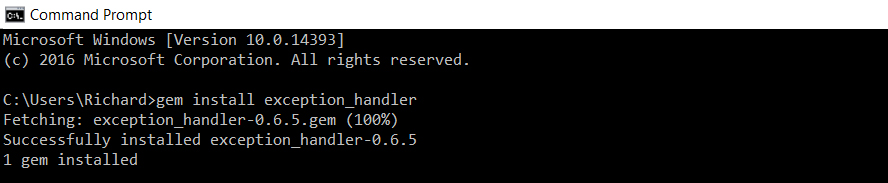
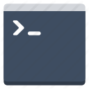
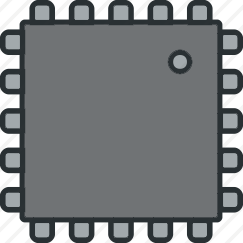

<p align="center">
  <font size="4"><strong>Custom 404 & 500 production error pages for Rails 4 & 5.</font></strong>
</p>

<p align="center">
  <a href="http://badge.fury.io/rb/exception_handler"></a>
  <a href="http://rubygems.org/gems/exception_handler"></a>
  <a href="https://codeclimate.com/github/richpeck/exception_handler"></a>
  <a href="https://gemnasium.com/richpeck/exception_handler"></a>
  <a href='https://coveralls.io/github/richpeck/exception_handler?branch=master'></a>
  <a href="https://travis-ci.org/richpeck/exception_handler"></a>
</p>

<p align="center">
  <strong><a href="#install">Install</a></strong> → <strong><a href="#config">Setup</a></strong> → <strong><a href="#support">Support</a></strong>
</p>

---

<p align="center">
  <br/>
</p>

<p align="center">
  &nbsp; <strong>Responsive</strong> &nbsp;
  &nbsp; <strong>Branded Error Pages</strong> &nbsp;
  &nbsp; <strong>Middleware Exception Handling</strong> &nbsp;
  &nbsp; <strong>Fully Customizable</strong> &nbsp;
</p>

<p align="center">
   
   
</p>

---

<p align="center">
  
</p>

---

<p align="center">
  <br />
  
</p>

<p align="center">
  &nbsp; <strong align="absmiddle">New Controller</strong> &nbsp;
  &nbsp; <strong align="absmiddle">New Middleware</strong> &nbsp;
  &nbsp; <strong align="absmiddle">Full Test Suite</strong> &nbsp;
  &nbsp; <strong align="absmiddle">Fully Rails 4 & 5 Compatible</strong> &nbsp;
</p>

Brand new `controller` & `middleware` have made **`ExceptionHandler`** even more powerful & efficient. Now you can use `ExceptionHandler` with a [single click](#install) → **plug and play** custom exception pages:

<p align="center">
  <br />
  
  
</p>

<p align="center">For over 3 years, <strong>ExceptionHandler</strong> has provided production-level <strong>Rails</strong> exception handling for <strong>4xx</strong> and <strong>5xx</strong> errors:</p>

![HTTP Error Codes][http_codes]

Since **browsers only read `4xx` & `5xx` error codes**, all Rails exceptions have to be inferred. Thus, `ExceptionHandler` simply has to manage how the `4xx` / `5xx` errors are passed to the browser.

Unlike other gems, **`ExceptionHandler` uses a custom [`controller`](app/controllers/exception_handler/exceptions_controller.rb) to build an [`@exception`](app/models/exception_handler/exception.rb) object**. This allows us to save the exception, email it or do anything else we may need. The gem has already been a massive success and we continue to actively maintain it.

Now you can try for yourself ...


----

<p align="center">
  <br />
  
</p>

The secret lies in [**`config.exceptions_app`**][exception_app] ↴

![Exceptions handled by the ActiveDispatch::ShowExceptions Middleware][middleware]

All Rails exceptions are handled by `config.exceptions_app`:

> **`config.exceptions_app`** sets the exceptions application invoked by the **`ShowException`** middleware when an exception happens. Defaults to **`ActionDispatch::PublicExceptions.new(Rails.public_path)`**

Each time an exception is raised, [`ShowExceptions`][show_exception] takes the request and forwards it to `config.exceptions_app`. This is expected to return a response - allowing us to inject a [`controller`](app/controllers/exception_handler/exceptions_controller.rb):

> ```app.config.exceptions_app = ->(env) { ExceptionHandler::ExceptionsController.action(:show).call(env) }```

![config.exceptions_app - The key to all Rails exceptions][exceptions_app]

Because our callback handles the entire request, we are able to do whatever we need before serving a response. This is a **major** advantage over the "default" (routes). The routes invokes Rails twice and does not persist the request.

 **`ExceptionHandler` is the only gem to provide middleware-powered exception handling.**  It populates our custom `view` with details, giving us the ability to **maintain branding** when exceptions are raised:

![Exceptions handled by the ActiveDispatch::ShowExceptions Middleware][middleware]

**`ExceptionHandler` is the most EFFECTIVE and EFFICIENT gem to handle exceptions in Rails**.

Once invoked, its `model`, `controller` and `views` work together to serve the best responses to Rails errors ...

----------

<p align="center" id="install">
  <br />
  
  <br />
  <strong>Custom Rails Error Pages - ZERO configuration needed:</strong>
  <br />
</p>

<p align="center">
  <a href="http://rubygems.org/gems/exception_handler"></a> <a href="http://rubygems.org/gems/exception_handler"></a>
</p>


<p align="center">
  You can install it from the <strong>CLI</strong> or <strong>Gemfile</strong> - it will AUTOMATICALLY run in <strong>production</strong>.
  <br />
  <strong>↓ To run in development, use <a href="#dev-mode">dev mode</a> ↓</strong>
</p>

---

<p align="center">
  If you want to set it up your way, you can use these features...
</p>

<p align="center">
  <a href="#config"> Config</a>&nbsp;&nbsp;&nbsp;&nbsp;<a href="#dev-mode" title="Dev Mode"> Dev</a>&nbsp;&nbsp;&nbsp;&nbsp;<a href="#database">  Database</a>&nbsp;&nbsp;&nbsp;&nbsp;<a href="#email">  Email</a>&nbsp;&nbsp;&nbsp;&nbsp;<a href="#views">  Views</a>&nbsp;&nbsp;&nbsp;&nbsp;<a href="#locales">  Locales</a>&nbsp;&nbsp;&nbsp;&nbsp;<a href="#custom-exceptions">  Custom Exceptions</a>&nbsp;&nbsp;&nbsp;&nbsp;<a href="#generators">  Generators</a>
</p>

----

## Config

**From [`0.4.7`](https://github.com/richpeck/exception_handler/releases/tag/0.4.6), `ExceptionHandler` manages its [config](lib/exception_handler/config.rb#L45) from the central Rails `config` hash:**

[![config][config]](lib/exception_handler/config.rb#L45)

If you're using an [`engine`](http://guides.rubyonrails.org/engines.html), you don't need to use an `initializer`:

    # lib/engine.rb
    module YourModule
      class Engine < Rails::Engine

        # => ExceptionHandler
        # => Works in and out of an initializer
        config.exception_handler = {
          dev: false,
          db:  true
        }
      end

    end

You only need to provide the inputs you want, for example:

    # config/application.rb
    config.exception_handler = { dev: true }

    # config/environments/production.rb
    config.exception_handler = { social: { fusion: "flutils" }}

----

## Dev Mode

**By default, `ExceptionHandler` only works in production.**

If you want to enable it in dev, enable the [`dev`](lib/exception_handler/config.rb#L38) option:

    # config/application.rb
    config.exception_handler = { dev: true }

This disables [`config.consider_all_requests_local`](http://guides.rubyonrails.org/configuring.html#rails-general-configuration), making Rails behave as it would in production. This gives you the ability to edit the exception flow, either creating your own interface or ensuring it works correctly:

[[ two screens showing the transition ]]

----

## Database

**We also have `ActiveRecord` integration.**

If you want to save your exceptions to `db`, you need to enable the `db` config option:

    # config/application.rb
    config.exception_handler = {
      db: true
    }

This enables `ActiveRecord::Base` on the [`Exception`](app/models/exception_handler/exception.rb) class, allowing us to save to the database.

In order for this to work, your db needs the correct table.

To do this, once you've enabled the option, run `rails db:migrate` from your console. Our new [`migration system`](https://github.com/richpeck/exception_handler/tree/readme#migrations) will automatically run the migration.

---

## Email

**`ExceptionHandler` also now sends email notifications.**

If you want to receive emails whenever your application raises an error, you can do so by adding your email to the config:

    # config/application.rb
    config.exception_handler = {
      email: "your@email.com"
    }

> **Please Note** this requires [`ActionMailer`](http://guides.rubyonrails.org/action_mailer_basics.html). If you don't have any outbound SMTP server, [`SendGrid`](http://sendgrid.com) is free.

[Full tutorial here](https://github.com/richpeck/exception_handler/wiki/2-Email)

---

## Views

**From [`0.7.0`](#070), we overhauled the view system:**

![View][view_img]

[Wiew](app/views/exception_handler/exceptions/show.html.erb) is modular - `@exception` populated with [`locales`](#locales).

---

## Locales

**[`0.7.5`](https://github.com/richpeck/exception_handler/releases/tag/0.7.5) introduced [locales](config/locales/exception_handler.yml) ...**

[[ locales ]]

The `ExceptionHandler` view is populated by [`@exception.description`](app/models/exception_handler/exception.rb#L121), which pulls from the `locales`.

If you want custom messages, you need the following. The key is defined by the HTTP [`status_code`](https://github.com/rack/rack/blob/1.5.2/lib/rack/utils.rb#L544)

    # config/locales/en.yml
    en:
      exception_handler:
        not_found: "Your message here"
        unauthorized: "You need to login to continue"
        internal_server_error: "This is a test to show the %{status} of the error"

You get access to `%{message}` and `%{status}`, both inferring from `@exception`.

---

## Layout

**The `layout` has also been improved ↴**

![Layout][layout_img]

We now assign layouts to the **status code** of the response:

![Layout][layouts_img]

By default, `5xx` errors are shown with our [`exception` layout][layout] - this can be overridden by changing the `config` to use a layout of your choice. If you want to inherit the `ApplicationController` layout, assign the codes to `nil`.

[[ layout ]]

The *majority* our `layout` is handled with the CSS. This allows the view to be completely modular:

[[ CSS ]]

---


## Custom Exceptions

**Custom Exceptions also supported in [`0.7.5`](https://github.com/richpeck/exception_handler/releases/tag/0.7.5)**

Rails handles this for us - [**`config.action_dispatch.rescue_responses`**][rescue_responses]  ↴

![ActionDispatch][config.action_dispatch.rescue_responses]

You need to add to the `rescue_responses` hash in your app's config (mapped to [`status codes`](https://github.com/rack/rack/blob/1.5.2/lib/rack/utils.rb#L544)):

    # config/application.rb
    config.action_dispatch.rescue_responses["ActionController::YourError"] = :bad_request

Because `HTTP` can only process `4xx` / `5xx` errors, if `Rails` raises an exception, it needs to assign one of the error status codes. **Default** is [`internal_server_error`](https://github.com/rack/rack/blob/1.5.2/lib/rack/utils.rb#L595) - if you'd prefer your app to just return `500` errors for your custom exception, you don't need to explicitly declare them.

---

## Generators

**You can generate `ExceptionHandler` into your own application.**

[[ Generator ]]

The following commands will copy the directories...

    rails g exception_handler:views
    rails g exception_handler:views -v views
    rails g exception_handler:views -v controllers
    rails g exception_handler:views -v models
    rails g exception_handler:views -v assets
    rails g exception_handler:views -v views controllers models assets

If you don't include any switches, this will copy **all** the folders put into your app.

Each switch defines which folders you want (EG `-v views` will only copy `views` dir).

---

### Migrations (deprecated)

**From [`0.7.5`](https://github.com/richpeck/exception_handler/releases/tag/0.7.5), the `migration` generator has been removed in favour of our own [migration system](lib/exception_handler/engine.rb#L58)**

You don't need to generate a migration any more.

If you set the `db` option in config, run `rails db:migrate` and the migration will be run.

To rollback, use the following:

    rails db:migrate:down VERSION=000000

> The drawback to this is that if you remove `ExceptionHandler` before you rollback the migration, it won't exist anymore. You can **only** fire the `rollback` when you have `ExceptionHandler` installed.

---

## Support

[Issues](https://github.com/richpeck/exception_handler/issues)

---

## Changelog

### [0.7.5](https://github.com/richpeck/exception_handler/releases/tag/0.7.5)
 - [x] [HTTP status layouts](#layouts)

### [0.7.0](https://github.com/richpeck/exception_handler/releases/tag/0.7.0)
 - [x] Wildcard mime types
 - [x] [Custom exceptions](#custom_exceptions)
 - [x] Test suite integration
 - [x] [Email](#email)
 - [x] [Model backend](#database)
 - [x] Sprockets 4+
 - [x] New layout
 - [x] Readme / wiki overhaul

### [0.6.5](https://github.com/richpeck/exception_handler/releases/tag/0.6.5)
 - [x] Streamlined interface
 - [x] ActiveRecord / Middleware overhaul
 - [x] Supports Sprockets 4+ ([`manifest.js`](http://eileencodes.com/posts/the-sprockets-4-manifest/))
 - [x] Email integration
 - [x] Asset overhaul & improvement
 - [x] Removed dependencies

### [0.5.0](https://github.com/richpeck/exception_handler/releases/tag/0.5.0)
 - [x] Locales
 - [x] Email notifications
 - [x] Full test suite
 - [x] Rails 4.2 & Rails 5.0 native ([`request.env`](https://github.com/rails/rails/commit/05934d24aff62d66fc62621aa38dae6456e276be) fix)
 - [x] Controller fixed
 - [x] `DB` fixed
 - [x] Legacy initializer support ([more](https://github.com/richpeck/exception_handler/wiki/1-Setup))
 - [x] Rails asset management improvement
 - [x] Reduced gem file size

### [0.4.7](https://github.com/richpeck/exception_handler/releases/tag/0.4.6)
 - [x] New config system
 - [x] Fixed controller layout issues
 - [x] Streamlined middleware
 - [x] New layout & interface

----

[![404 + 500 Errors][banner]][rubygems]

<p align="center">
  <strong><a href="#">ExceptionHandler</a> is now the leading custom error pages gem for Rails.</strong>
  <br />
  No other gem is as simple or effective at providing beautiful exception pages in production.
</p>

<p align="center">
  <a href="http://badge.fury.io/rb/exception_handler"></a>
  <a href="http://rubygems.org/gems/exception_handler"></a>
  <a href="https://codeclimate.com/github/richpeck/exception_handler"></a>
  <a href="https://gemnasium.com/richpeck/exception_handler"></a>
  <a href='https://coveralls.io/github/richpeck/exception_handler?branch=master'></a>
  <a href="https://travis-ci.org/richpeck/exception_handler"></a>
</p>

<p align="center">
  <strong><a href="https://rubygems.org/gems/exception_handler">Download Here</a></strong>
</p>

----------

:copyright: <a href="http://www.frontlineutilities.co.uk" align="absmiddle" ></a> <a href="http://stackoverflow.com/users/1143732/richard-peck?tab=profile" align="absmiddle" ></a>

<!-- ################################### -->
<!-- ################################### -->

<!-- Refs -->
<!-- Comments http://stackoverflow.com/a/20885980/1143732 -->
<!-- Images   https://github.com/adam-p/markdown-here/wiki/Markdown-Cheatsheet#images -->

<!-- Images -->
[layouts_img]:      readme/layouts.jpg
[layout_img]:       readme/layout.png
[view_img]:         readme/view.jpg
[http_codes]:       readme/http_codes.png
[config]:           readme/config.jpg
[config.action_dispatch.rescue_responses]: readme/config.action_dispatch.rescue_responses.jpg
[banner]:           readme/banner.jpg
[gem]:              readme/gem.jpg
[gemfile]:          readme/gemfile.jpg
[middleware]:       readme/middleware.jpg
[exceptions_app]:   readme/exceptions_app.jpg
[view]:             readme/titles/view.jpg
[dev]:              readme/titles/dev.jpg
[db]:               readme/titles/db.png
[support]:          readme/titles/support.png "Support"
[changelog]:        readme/titles/changelog.png "Changelog"
[contribution]:     readme/titles/contributions.png "Contributions"
[fl]:               readme/fl.jpg "Frontline Utilities LTD"
[profile]:          https://avatars0.githubusercontent.com/u/1104431 "R Peck"

<!-- Links -->
[better_errors]: https://github.com/charliesome/better_errors
[layout]: app/views/layouts/exception.html.erb
[status_codes]: http://guides.rubyonrails.org/layouts_and_rendering.html#the-status-option
[stackoverflow]: http://stackoverflow.com/questions/ask?tags=ruby-on-rails+exception-handler
[rescue_responses]: http://guides.rubyonrails.org/configuring.html#configuring-action-dispatch
[latest]: https://github.com/richpeck/exception_handler/releases/latest
[show_exception]: https://github.com/rails/rails/blob/4-0-stable/actionpack/lib/action_dispatch/middleware/show_exceptions.rb
[exception_app]: http://guides.rubyonrails.org/configuring.html#rails-general-configuration
[rubygems]: http://rubygems.org/gems/exception_handler
[frontlineutilities.co.uk]: http://www.frontlineutilities.co.uk
[stackoverflow.com]: http://stackoverflow.com/users/1143732/richard-peck?tab=profile
[fork]: #fork-destination-box
[pull]:  http://github.com/richpeck/exception_handler/pulls
[issues]: http://github.com/richpeck/exception_handler/issues

<!-- ################################### -->
<!-- ################################### -->
