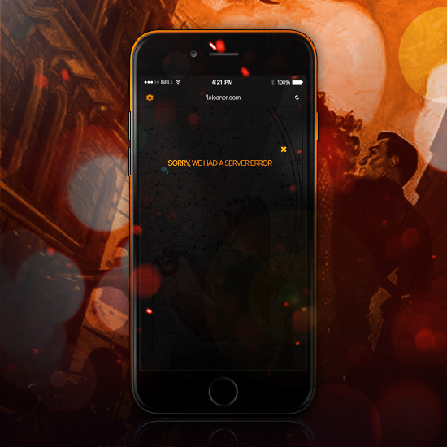

<!-- Intro -->

  <h4 align="center"><strong><a href="https://rubygems.org/gems/exception_handler"><code>ExceptionHandler</code></a></strong> is presently the <strong>most popular exception gem</strong> for <strong><a href="https://medium.com/ruby-on-rails-web-application-development/custom-400-500-error-pages-in-ruby-on-rails-exception-handler-3a04975e4677">Rails 400/500 error pages</a></strong></h4>
  

    With <strong>180,000+ downloads</strong>, it is the *only* gem to provide <strong>plug-and-play custom exception pages for Rails 4 + 5</strong>...
  

<!-- Badges -->

  
  
  
  
  

<!-- Examples -->

   
   

  --

Our system works by overriding the [`exceptions_app`](https://guides.rubyonrails.org/configuring.html#rails-general-configuration) hook in the core of Rails.

This is called by the [`ActionDispatch::ShowExceptions`](https://github.com/rails/rails/blob/fc5dd0b85189811062c85520fd70de8389b55aeb/actionpack/lib/action_dispatch/middleware/show_exceptions.rb) middleware, and basically provides the HTML for any erroneous requests.

It interjects our own controller/views into this process, allowing for fully customized error pages. The most important thing to realize about it is that it's entirely built with the Rails subsystem - meaning that it doesn't hack and is perfectly fine for production use.

[Downloaded 180,000+ times][rubygems], it is widely considered the leading exceptions management gem for Ruby on Rails 4 & 5. Not only is it easy to use, but it's the most flexible and extensible system for the ecosystem.

The following explains how it works...

<!-- Navigation -->

  

  

    <b>⌚️ <a href="#introduction">Introduction</a> ⌚️</b> - <strong>⚠️ <a href="#installation">Installation</a> ⚠️</strong> - <strong>⚙️ <a href="#configuration">Configuration</a> ⚙️</strong> - <strong>☎️ <a href="#support">Support</a> ☎️</strong> - <strong>⭐ <a href="#changelog">Changelog</a> ⭐</strong>
  

  

<!-- Introduction -->

  <h4>📝 Introduction</h4>

---

`ExceptionHandler` was designed to replace Rails' default error pages ([`400.html`, `422.html`, `500.html`](https://github.com/rails/rails/tree/ef0b05e78fb0b928c7ef48d3c365dc849af50305/railties/lib/rails/generators/rails/app/templates/public)) with dynamic views...

[ image - rails default vs new]

The gem inserts a custom [ `controller`](app/controllers/exception_handler/exceptions_controller.rb) into [`exceptions_app`](http://guides.rubyonrails.org/configuring.html#rails-general-configuration), allowing us to render custom HTML for erroneous requests.

The controller uses a *single* method/view to build a response to errors. This view remains the same for *every* exception; the ONLY change is the *[layout](/app/views/layouts/exception.html.erb)* - depending on the HTTP response being returned (`4xx`/`5xx`).

The beauty lies in the *simplicity* through which this is achieved → rather than having many different elements, its SOLE focus is to provide different HTML responses via differing *layouts*. `ExceptionHandler` does this within the scope of [`ActionView`](http://guides.rubyonrails.org/action_view_overview.html), allowing for the use of `views`, `helpers` and `data` from the database.

Gem works 100% out of the box in `production`, and has the option to be called in [`dev`](#dev) if necessary.
To fully understand why this is the default flow, you need to appreciate the [HTTP error process](https://www.digitalocean.com/community/tutorials/how-to-troubleshoot-common-http-error-codes) ↴

--

##### 📑 HTTP Error Management

The most important thing to understand is that *it doesn't matter* which errors Ruby/Rails raises - they *all* need to be wrapped in a [valid HTTP response](https://www.w3.org/Protocols/rfc2616/rfc2616-sec6.html). Due to the nature of HTTP, you only need to facilitate responses for [`4xx`](https://en.wikipedia.org/wiki/List_of_HTTP_status_codes#4xx_Client_errors) - [`5xx`](https://en.wikipedia.org/wiki/List_of_HTTP_status_codes#5xx_Server_errors).

This means that all you're really doing is taking "Ruby" errors and giving them an appropriate [HTTP status code](https://en.wikipedia.org/wiki/List_of_HTTP_status_codes) & [message body](https://en.wikipedia.org/wiki/HTTP_message_body) (HTML). Rails handles the process for you - the *only* thing we need to worry about is how the HTML is generated.  

What confuses most is the way in which Rails does this. The process is handled by [`ActionDispatch::ShowExceptions`](https://github.com/rails/rails/blob/master/actionpack/lib/action_dispatch/middleware/show_exceptions.rb#L44) - which builds a new response out of the one passed to it by the exception generator. Through this process, it calls whichever class is present in [`exceptions_app`](http://guides.rubyonrails.org/configuring.html#rails-general-configuration)...

    # show_exceptions.rb
    def render_exception(request, exception)
      backtrace_cleaner = request.get_header "action_dispatch.backtrace_cleaner"
      wrapper = ExceptionWrapper.new(backtrace_cleaner, exception)
      status  = wrapper.status_code
      request.set_header "action_dispatch.exception", wrapper.exception
      request.set_header "action_dispatch.original_path", request.path_info
      request.path_info = "/#{status}"
      response = @exceptions_app.call(request.env) #-> this is where the HTML is generated
      response[1]["X-Cascade"] == "pass" ? pass_response(status) : response
    rescue Exception => failsafe_error
      $stderr.puts "Error during failsafe response: #{failsafe_error}\n  #{failsafe_error.backtrace * "\n  "}"
      FAILSAFE_RESPONSE
    end

In other words, what a user *sees* has very little to do with the fact Rails experienced an error. `ExceptionHandler` doesn't change this behaviour - it simply *adds* our own controller/views setup to provide the HTML...

-

To better explain, there are **<a href="https://tzamtzis.gr/2017/digital-analytics/http-status-codes/">5️⃣ types of HTTP status code</a>** - [`10x`][10x], [`20x`][20x], [`30x`][30x], [`40x`][40x], & [`50x`][50x].

Each does its own thing, but what's important is they *ALL* describe "responses" that your web browser will receive for HTTP requests. The only *erroneous* status codes are `4xx` (client error) or `5xx` (server error)...

  

The point is that when you're dealing with "errors" online, you're *actually* dealing with erroneous **HTTP STATUS CODES**. The response delivered with these codes is *ALWAYS* going to remain the same; difference lying in how they're built (on the server).

By default, `NGinx` + `Apache` use "static" HTML pages to show the errors - if we're using Rails, we have the ability to create *our own* pages. This is exactly what our gem has been designed to do.

**`ExceptionHandler`** provides Rails with the ability to serve ***dynamic*** exception pages, built with **your *own*** layouts/views. By overriding the <a href="http://guides.rubyonrails.org/configuring.html#rails-general-configuration">`exceptions_app`</a> hook, it provides a custom `controller`, `model` and `views` to display custom error pages.

The system is 100% compatible with Rails 4 & 5 and has already been downloaded **180,000+** times...

--

##### ⛔️ Middleware-Powered Exceptions

To add to this, you also need to appreciate that `exception_handler` integrates into the middleware layer - meaning that we're able to utilize parts of the Rails stack other gems cannot:

  

Unlike other gems, which focus on hacking Rails, ours injects its own controller into the `exceptions_app` hook.

This hook is meant to provide HTML code for any exceptions raised by Rails, and is completely customizable. By default, it is set to ping `ActionDispatch::PublicExceptions.new(Rails.public_path)` - which should return the pages in the public folder.

In short, most people think that because Rails raised an error, the underlying system is unable to render customized HTML. This is incorrect. Because `exceptions_app` is based on the Rack middleware stack, `ExceptionHandler` is able to use the `ActionView` pipeline to render your layouts and perform other tasks.

Whilst `ExceptionHandler` isn't the only exception gem for Rails, it's the first to use the above method. This makes it perfect for production, highly scalable and completely customizable. The following shows how...

<!-- Sep -->

  

<!-- Installation -->

  <h4>⚠️ Installation</h4>

---

    # Gem
    gem install exception_handler

    # Gemfile
    gem `exception_handler`, '~> 0.8.0.0'

The gem is available on [RubyGems][rubygems] and is fully compatible with Rails 4 + 5.

Installation works by overriding the `exceptions_app` hook - which means that it is *always* present in production.

**You literally have to do nothing to get it working in production.** Just install the gem and it will provide custom 400/500 exception pages. The `4xx` pages will use your app's standard layout, `5xx` has its own [custom layout][layouts]. Both can be customized.

To get it working in development, we've included a [`dev`][dev] mode, which overrides the `consider_all_requests_local` option inside Rails. This is consequential; the core of the gem is robust and works on 1,000's of apps which have graciously chosen to run it.

<!-- Sep -->

  

<!-- configuration -->

  <h4>⚙️ Configuration</h4>

----

dfgdf

<!-- Sep -->

  

<!-- Support -->

  <h4>☎️ Support</h4>

---

fgfg

<!-- Sep -->

  

<!-- Changelog -->

  <h4>⭐ Changelog</h4>

---

[**1.0.0.0**](https://github.com/richpeck/exception_handler/releases/tag/v1.0.0.0)
  - [ ] TBA

[**0.8.0.0**](https://github.com/richpeck/exception_handler/releases/tag/v0.8.0.0)
 - [x] [README](https://github.com/richpeck/exception_handler/issues/52) (focus on utility)
 - [x] Introduction of `4xx`,`5xx`,`:all` for layouts config
 - [x] Changed `layouts` to `exceptions` in config    
 - [x] Email improvement
 - [x] Streamlined migration
 - [x] Updated model

[**0.7.7.0**](https://github.com/richpeck/exception_handler/releases/tag/v0.7.7.0)
 - [x] [HTTP status layouts](#layouts)

**0.7.0.0**
 - [x] Wildcard mime types
 - [x] [Custom exceptions](#custom_exceptions)
 - [x] Test suite integration
 - [x] [Model backend](#database)
 - [x] Sprockets 4+
 - [x] New layout
 - [x] Readme / wiki overhaul

**0.6.5.0**
 - [x] Streamlined interface
 - [x] ActiveRecord / Middleware overhaul
 - [x] Supports Sprockets 4+ ([`manifest.js`](http://eileencodes.com/posts/the-sprockets-4-manifest/))
 - [x] Email integration
 - [x] Asset overhaul & improvement
 - [x] Removed dependencies

**0.5.0.0**
 - [x] Locales
 - [x] Email notifications
 - [x] Full test suite
 - [x] Rails 4.2 & Rails 5.0 native ([`request.env`](https://github.com/rails/rails/commit/05934d24aff62d66fc62621aa38dae6456e276be) fix)
 - [x] Controller fixed
 - [x] `DB` fixed
 - [x] Legacy initializer support ([more](https://github.com/richpeck/exception_handler/wiki/1-Setup))
 - [x] Rails asset management improvement
 - [x] Reduced gem file size

**0.4.7.0**
 - [x] New config system
 - [x] Fixed controller layout issues
 - [x] Streamlined middleware
 - [x] New layout & interface

 <!-- Sep -->
 

   
 

 [![404 + 500 Errors][banner]][rubygems]

 

   <strong><a href="https://rubygems.org/gems/exception_handler"><code>ExceptionHandler</code></a> provides custom error pages gem for Rails 4 & 5...</strong>
    
   No other gem is as simple or effective at providing branded exception pages in production
 

 

   
   
   
   
   
 

 

   <strong>➡️ <a href="https://rubygems.org/gems/exception_handler">Download & Info</a> ⬅️</strong>
 

 <!-- Sep -->
 

   
 

:copyright:         

<!-- ################################### -->
<!-- ################################### -->

<!-- Refs -->
<!-- Comments http://stackoverflow.com/a/20885980/1143732 -->
<!-- Images   https://github.com/adam-p/markdown-here/wiki/Markdown-Cheatsheet#images -->

<!-- Images -->
[banner]:readme/banner.jpg

<!-- Links -->
[rubygems]: http://rubygems.org/gems/exception_handler

[10x]: https://en.wikipedia.org/wiki/List_of_HTTP_status_codes#1xx_Informational_responses
[20x]: https://en.wikipedia.org/wiki/List_of_HTTP_status_codes#2xx_Success
[30x]: https://en.wikipedia.org/wiki/List_of_HTTP_status_codes#3xx_Redirection
[40x]: https://en.wikipedia.org/wiki/List_of_HTTP_status_codes#4xx_Client_errors
[50x]: https://en.wikipedia.org/wiki/List_of_HTTP_status_codes#5xx_Server_errors

<!-- Local Links -->
[db]: #db
[email]: #email
[dev]: #dev
[layouts]: #layouts

<!-- ################################### -->
<!-- ################################### -->
