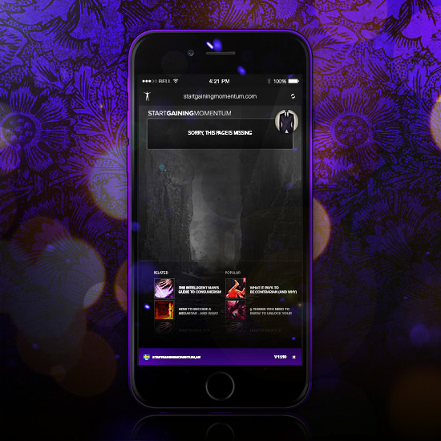
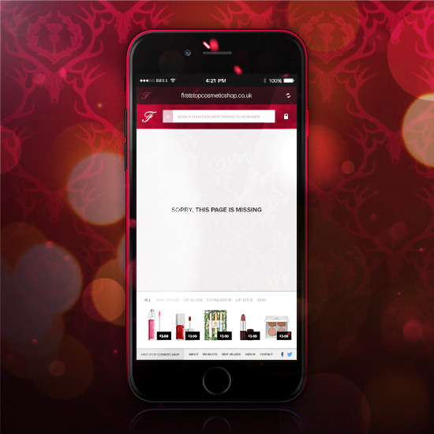

<a href="https://www.vpsdeploy.com">
  
</a>
<hr />
<p align="center">
  <strong>💣 README Updated 💣 - Also incorporated into 💀 <a href="https://www.vpsdeploy.com" title="Custom VPS Deployment For Rails"><u>VPSDeploy.com - VPS Deployment Solution</u></a> 💀 -<br/><code>Custom Programming Tutorials</code> + <code>Deployment Infrastructure</code> For Cloud VPS Providers...</strong>
</p>
<hr />


<p align="center">
  <br />
</p>

<p align="center">
  
</p>

<p align="center">
  <strong>➡️ <code>ExceptionHandler</code> is a <a href="https://medium.com/ruby-on-rails-web-application-development/custom-400-500-error-pages-in-ruby-on-rails-exception-handler-3a04975e4677"><code>Custom Error Pages Gem</code></a> For Ruby on Rails ⬅️</strong> - With <strong>160,000+ downloads</strong>, it is now one of the most <strong>POPULAR</strong>, <strong>ROBUST</strong> & <strong>EXTENSIBLE</strong> exceptions management gems for <strong><a href="https://rubygems.org/gems/exception_handler">Ruby on Rails 4 & 5+</a></strong>... 
</p>

<p align="center">
  <a href="http://badge.fury.io/rb/exception_handler"></a>
  <a href="http://rubygems.org/gems/exception_handler"></a>
  <a href="https://codeclimate.com/github/richpeck/exception_handler"></a>
  <a href="https://gemnasium.com/richpeck/exception_handler"></a>
  <a href='https://coveralls.io/github/richpeck/exception_handler?branch=master'></a>
  <a href="https://travis-ci.org/richpeck/exception_handler"></a>
</p>

<p align="center">
  
  
</p>

<p align="center">
  <strong><a href="https://github.com/richpeck/exception_handler/releases/tag/v0.8.0.0">🏹 <code>0.8.0.0</code> 🏹</a></strong> → <strong><A href="#config">🚧 CONFIG SETTINGS 🚧</a></strong> now <strong>*EVEN STRONGER*</strong> and more powerful than before ▪️ <br /> <strong>💻 CUSTOM Views Options 💻</strong> ▪️ <strong>💬 <code>4xx</code>/<code>5xx</code> LOCALES 💬</strong> + <strong>more</strong>...  
</p>

<p align="center">
  With its <strong>NEW infrastructure</strong>, <code>ExceptionHandler</code> is now the <strong>LEADING CUSTOM ERROR PAGES GEM</strong> for Ruby on Rails. No other rivals its ease-of-use, extensibility, effectiveness or power...  
</p>

<p align="center">
   
   
</p>

<p align="center">
  <strong>⚠️ *README* explains how it works... ⚠️</strong>
  <br /><strong><a href="mailto: rpeck@frontlineutilities.co.uk" title="rpeck@fl.co.uk">✉️ Support Email ✉️</a></strong>
</p>

<!-- Navigation -->
<div id="navigation">
  <p align="center"></p>
  <p align="center">
    <b>⌚️ <a href="#introduction">Introduction</a> ⌚️</b> ▪️ <strong>✔️ <a href="#installation">Installation</a> ✔️</strong> ▪️ <strong>🔨 <a href="#setup">Setup</a> 🔨</strong> ▪️ <strong>☎️ <a href="#support">Support</a> ☎️</strong> ▪️ <strong>⭐ <a href="#changelog">Changelog</a> ⭐</strong>
  </p>
  <p align="center"></p>
</div>

<!-- Version -->
<p align="center">
  
</p>

<p align="center">
  &nbsp; <strong>Responsive</strong> &nbsp;
  &nbsp; <strong>Branded Error Pages</strong> &nbsp;
  &nbsp; <strong>Middleware Exception Handling</strong> &nbsp;
  &nbsp; <strong>Fully Customizable</strong> &nbsp;
</p>

<p align="center">
   
   
</p>

<!-- Introduction -->
<div id="introduction">
  <p align="center"></p>
  <p>
    <h3>⌚️ Introduction ⌚️</h3>
  </p>
  <p align="center"></p>
</div>

**There are 2️⃣ types of HTTP "error"** → **[`4xx (Client Error)`][40x]** & **[`5xx  (Server Error)`][50x]** ↴

<p align="center">
  
</p>

**HTTP errors don't mean anything - they're [**`STATUS CODES`**](https://en.wikipedia.org/wiki/List_of_HTTP_status_codes)**. If you're seeing an "error" from a website / app, you're basically seeing the result of an ***erroneous* HTTP status code** ([`4xx`][40x] or [`5xx`][50x]).

This means it ***doesn't matter*** what is shown in the browser. **ALL HTTP status codes behave in the same way** - they deliver  a "payload" ([HTML Message Body](https://en.wikipedia.org/wiki/HTTP_message_body)) which is shown to the client. Successful HTTP requests have a `200` status code; `Missing Page` requests have a `404` status code. In *BOTH* cases (despite one being erroneous), the browser displays the response from the server. 

This payload is typically created by the website / app, but if no response is provided (for example, in the case of a `500` error), most web servers will provide its own "static" error page (to provide *something* by way of a response)...


In the case of Rails, this functionality is provided by the `400.html` and `500.html` *static* error pages in the `/public` folder...

<p align="center">
  
</p>

Whilst <b>only 2️⃣ are erroneous</b>, there are **5️⃣ types of <a href="https://en.wikipedia.org/wiki/List_of_HTTP_status_codes">HTTP status code</a>** - [`10x`][10x], [`20x`][20x], [`30x`][30x], [`40x`][40x], & [`50x`][50x].

Each has their own reason for existing, but what's important is <b>they *ALL* describe "responses" that your web browser will receive for HTTP requests</b>...  

[[ image - static pages ]]

The point is that when you're dealing with "errors" online, you're *actually* dealing with erroneous **STATUS CODES**. The *response* delivered by these codes is still exactly the same as the successful responses.

**`ExceptionHandler`** provides Rails with the ability to serve ***dynamic*** exception pages, built with **your *own*** layouts/views. By overriding the <a href="http://guides.rubyonrails.org/configuring.html#rails-general-configuration">`exceptions_app`</a> hook, it provides a custom `controller`, `model` and `views` to display custom error pages. The system is 100% compatible with Rails 4 & 5...

<p align="center">
   
   
</p>

<!-- Setup -->
<div id="setup">
  <p align="center"></p>
  <h3 align="center">🔨 Setup 🔨</h3>
  <p align="center">
    <a href="#config"> Config</a>&nbsp;&nbsp;&nbsp;&nbsp;<a href="#dev" title="Dev Mode"> Dev</a>&nbsp;&nbsp;&nbsp;&nbsp;<a href="#database">  Database</a>&nbsp;&nbsp;&nbsp;&nbsp;<a href="#email">  Email</a>&nbsp;&nbsp;&nbsp;&nbsp;<a href="#views">  Views</a>&nbsp;&nbsp;&nbsp;&nbsp;<a href="#locales">  Locales</a>&nbsp;&nbsp;&nbsp;&nbsp;<a href="#custom-exceptions">  Custom Exceptions</a>&nbsp;&nbsp;&nbsp;&nbsp;<a href="#generators">  Generators</a>
  </p>
  <p align="center">-- <br />The <i>most</i> important thing to apprecaite about the gem is that</p>
  <p align="center"></p>
</div>

<!-- Config -->
<p id="config">
  <h4>🚧 Config 🚧</h4>
</p>  

**ONLY thing you need to get `ExceptionHandler` working is the [`config`](https://github.com/richpeck/exception_handler/blob/master/lib/exception_handler/config.rb)**.

Whilst it works without the need for **ANY** configuration, if you want to manage the `layouts`, `email`, `dev` or `database`, you'll need to set the appropriate values in the config hash ([invoked at init](https://github.com/richpeck/exception_handler/blob/master/lib/exception_handler/engine.rb#L44)).

This can be done with `config/application.rb`, `config/environments/[env].rb` or an `initializer`... 

```
# config/application.rb

module YourApp
  class Application < Rails::Application
  
    config.exception_handler = {
      dev:        nil, # allows you to turn ExceptionHandler "on" in development
      db:         nil, # allocates a "table name" into which exceptions are saved (defaults to :errors)
      email:      nil, # sends exception emails to a listed email (string // "you@email.com"),
      social: {        # on default 50x error page, social media links included
        facebook: nil, # Facebook page name   
        twitter:  nil, # Twitter handle  
        youtube:  nil, # Youtube channel name / ID
        linkedin: nil, # LinkedIn name
        fusion:   nil  # FL Fusion handle
      },  
      exceptions: { 
        :all => { 
          layout: "exception", # define layout 
          notification: true, # (false by default)
          deliver: #something here to control the type of response
        },
        :4xx => {
          layout: "application", # define layout 
          notification: true, # (false by default)
          deliver: #something here to control the type of response    
        },    
        :5xx => {
          layout: "exception", # define layout 
          notification: true, # (false by default)
          deliver: #something here to control the type of response    
        },
        :500 => {
          layout: "exception", # define layout 
          notification: true, # (false by default)
          deliver: #something here to control the type of response    
        },
        :501 => "exception",
        :502 => "exception",
        :503 => "exception",
        :504 => "exception",
        :505 => "exception",
        :507 => "exception",
        :510 => "exception"
      }
    }
    
  end
end
```  

For a full retinue of the available options, you'll be best looking at the [`config`](https://github.com/richpeck/exception_handler/blob/master/lib/exception_handler/config.rb) file itself.

In terms of how the system works,

```
# config/initializers/exception_handler.rb

config.exception_handler = {}
```

--

If using an [`engine`](http://guides.rubyonrails.org/engines.html), you **DON'T** need an `initializer`:

    # lib/engine.rb
    module YourModule
      class Engine < Rails::Engine

        # => ExceptionHandler
        # => Works in and out of an initializer
        config.exception_handler = {
          dev: nil, # => this will not load the gem in development
          db:  true # => this will use the :errors table to store exceptions
        }
      end

    end

The best thing about using a `config` options block is that you are able to only define the options that you require. This means that if you have particular options you *only* wish to run in `staging`, or have single options for `production` etc...  

---

<p id="dev">
  <h4>💻 Dev 💻</h4>
</p>  

As explained, `ExceptionHandler` does not work in `development` mode by default. This is because it overrides the `exceptions_app` middleware hook - which is only invoked in `production` or `staging`...

<p align="center">
  
</p>

To get it working in `development`, you need to override the [`config.consider_all_requests_local`](http://guides.rubyonrails.org/configuring.html#rails-general-configuration) setting (a standard component of Rails) - setting it to "false" ↴

<p align="center">
  
</p>

This is normally done by changing the setting in your Rails config files. However, to make the process simpler for `ExceptionHandler`- we've added a `dev` option which allows you to override the hook through the context of the gem...

```
# config/application.rb
config.exception_handler = { dev: true }

```

This disables [`config.consider_all_requests_local`](http://guides.rubyonrails.org/configuring.html#rails-general-configuration), making Rails behave as it would in production (showing your exceptions page):

![Dev][dev_img]

Obviously, this has other connotations including the likes of making your requests go through your production server etc. For this reason, it's *STRONGLY* recommended you only use the `dev` option to test your layouts etc.  

----

<p id="database">
  <h4>💾 Database 💾</h4>
</p>  

If you want to save exceptions to your database, you will need to migrate a new

```
# config/application.rb
config.exception_handler = { db: true }
```

This enables `ActiveRecord::Base` on the [`Exception`](app/models/exception_handler/exception.rb) class, allowing us to save to the database.

In order for this to work, your db needs the correct table.

To do this, once you've enabled the option, run `rails db:migrate` from your console. Our new [`migration system`](https://github.com/richpeck/exception_handler/tree/readme#migrations) will automatically run the migration.

---

<p id="email">
  <h4>✉️ Email ✉️</h4>
</p>  

**`ExceptionHandler` also now sends email notifications.**

If you want to receive emails whenever your application raises an error, you can do so by adding your email to the config:

    # config/application.rb
    config.exception_handler = {
      email: "your@email.com"
    }

> **Please Note** this requires [`ActionMailer`](http://guides.rubyonrails.org/action_mailer_basics.html). If you don't have any outbound SMTP server, [`SendGrid`](http://sendgrid.com) is free.

[Full tutorial here](https://github.com/richpeck/exception_handler/wiki/2-Email)

---

<p id="views">
  <h4>👓 Views 👓</h4>
</p>

The **views** system in `ExceptionHandler` is modular.

What *most* people want out of the view is to change the way it ***looks***. This can be done without changing the exception "view" itself...

<p align="center">
  
</p>

To better explain, if [`ExceptionsController`](https://github.com/richpeck/exception_handler/blob/0.8/app/controllers/exception_handler/exceptions_controller.rb) is invoked (by `exceptions_app`), it has **ONE** method ([`show`](https://github.com/richpeck/exception_handler/blob/0.8/app/controllers/exception_handler/exceptions_controller.rb#L42)). This method calls the [`show` view](https://github.com/richpeck/exception_handler/blob/0.8/app/views/exception_handler/exceptions/show.html.erb), which is *entirely* dependent on the locales for content & the layout for the look.

This means that if you wish to change how the view "looks" - you're *either* going to want to change your *layouts* or the [*locales*](#locales). There is NO reason to change the `show` view itself - it's succinct and entirely modular. Whilst you're definitely at liberty to change it, you'll just be making the issue more complicated than it needs to be.

-

If you wish to change the "layout" / "look", there are **two** options...

 * Firstly, you can create your own layout. This is done by changing the

 * Secondly,


---

<p id="locales">
  <h4>💬 Locales 💬</h4>
</p>  

Locales are used to denote interchangeable text (for different languages).

We've used it for a different purpose - to provide text for our "show" view. The beauty of this is that 1) It's entirely modular & 2) It's extensible (we are able to use as many locales as required)...

[[ locales ]]


The `ExceptionHandler` view is populated by [`@exception.description`](app/models/exception_handler/exception.rb#L121), which pulls from the `locales`.

If you want custom messages, you need the following. The key is defined by the HTTP [`status_code`](https://github.com/rack/rack/blob/1.5.2/lib/rack/utils.rb#L544)

    # config/locales/en.yml
    en:
      exception_handler:
        not_found: "Your message here"
        unauthorized: "You need to login to continue"
        internal_server_error: "This is a test to show the %{status} of the error"

You get access to `%{message}` and `%{status}`, both inferring from `@exception`.

---

<p id="layouts">
  <h4>📋 Layouts 📋</h4>
</p>  

**The `layout` has also been improved ↴**

![Layout][layout_img]

We now assign layouts to the **status code** of the response:

![Layout][layouts_img]

By default, `5xx` errors are shown with our [`exception` layout][layout] - this can be overridden by changing the `config` to use a layout of your choice. If you want to inherit the `ApplicationController` layout, assign the codes to `nil`.

---


<p id="custom-exceptions">
  <h4>⛔️ Custom Exceptions ⛔️</h4>
</p> 

**Custom Exceptions also supported in [`0.7.5`](https://github.com/richpeck/exception_handler/releases/tag/0.7.5)**

Rails handles this for us - [**`config.action_dispatch.rescue_responses`**][rescue_responses]  ↴

![ActionDispatch][config.action_dispatch.rescue_responses]

You need to add to the `rescue_responses` hash in your app's config (mapped to [`status codes`](https://github.com/rack/rack/blob/1.5.2/lib/rack/utils.rb#L544)):

    # config/application.rb
    config.action_dispatch.rescue_responses["ActionController::YourError"] = :bad_request

Because `HTTP` can only process `4xx` / `5xx` errors, if `Rails` raises an exception, it needs to assign one of the error status codes. **Default** is [`internal_server_error`](https://github.com/rack/rack/blob/1.5.2/lib/rack/utils.rb#L595) - if you'd prefer your app to just return `500` errors for your custom exception, you don't need to explicitly declare them.

---

<p id="generators">
  <h4>💼 Generators 💼</h4>
</p> 

**You can generate `ExceptionHandler` into your own application.**

[[ Generator ]]

The following commands will copy the directories...

    rails g exception_handler:views
    rails g exception_handler:views -v views
    rails g exception_handler:views -v controllers
    rails g exception_handler:views -v models
    rails g exception_handler:views -v assets
    rails g exception_handler:views -v views controllers models assets

If you don't include any switches, this will copy **all** the folders put into your app.

Each switch defines which folders you want (EG `-v views` will only copy `views` dir).

---

<p id="migrations">
  <h4>✔️ Migrations (deprecated) ✔️</h4>
</p> 

**From [`0.7.5`](https://github.com/richpeck/exception_handler/releases/tag/0.7.5), the `migration` generator has been removed in favour of our own [migration system](lib/exception_handler/engine.rb#L58)**

You don't need to generate a migration any more.

If you set the `db` option in config, run `rails db:migrate` and the migration will be run.

To rollback, use the following:

    rails db:migrate:down VERSION=000000

> The drawback to this is that if you remove `ExceptionHandler` before you rollback the migration, it won't exist anymore. You can **only** fire the `rollback` when you have `ExceptionHandler` installed.

<!-- Support -->
<div id="support">
  <p align="center"></p>
  <p align="center"></p>
  <p>asdfasdf</p> 
  <p align="center"></p>
</div>

You're welcome to access our [**Issues**](https://github.com/richpeck/exception_handler/issues) page to contact us directly. Alternatively, you could use [**StackOverflow**](https://stackoverflow.com/questions/tagged/ruby-on-rails+exceptionhandler)...

 - ⚠️ [**Issues**](https://github.com/richpeck/exception_handler/issues)
 - 📤 [**StackOverflow**](https://stackoverflow.com/questions/tagged/ruby-on-rails+exceptionhandler)
 - ✉️ [**Email**](mailto:rpeck@frontlineutilities.co.uk)
 - ✏️ [**Medium**](https://medium.com/ruby-on-rails-web-application-development/custom-400-500-error-pages-in-ruby-on-rails-exception-handler-3a04975e4677)
 - 🎥 [**YouTube**](https://www.youtube.com/channel/UCsPIR2s7iPdB7LrWHvaBgVg)

In the process of posting [**YouTube tutorials**](https://www.youtube.com/channel/UC5EMCOwsMbqvdTVGjMTDgPQ)...

<p align="center">
  <a href="https://www.youtube.com/channel/UC5EMCOwsMbqvdTVGjMTDgPQ"></a>
</p>

<!-- Changelog -->
<div id="changelog">
  <p align="center"></p> 
  <p align="center"></p>
  <p><code><a href="https://www.rubygems.org/gems/exception_handler">ExceptionHandler</a></code> is designed to provide <strong>CUSTOM ERROR PAGES</strong> for Ruby on Rails → not much more than that.</p>
  <p>If you're looking at adding <em>extra</em> functionality, such as a debugger, you'll probably be better looking at the likes of <code><a href="https://rubygems.org/gems/better_errors">better_errors</a></code> or <code><a href="https://rubygems.org/gems/gaffe">gaffe</a></code>.</p>
  <p>Below shows what we've built...</p>
  <p align="center"></p>
</div>

### 👻 [1.0.0.0](https://github.com/richpeck/exception_handler/releases/tag/v1.0.0.0)
  - [ ] TBA

### 🏹 [0.8.0.0](https://github.com/richpeck/exception_handler/releases/tag/v0.8.0.0)
 - [x] [README](https://github.com/richpeck/exception_handler/issues/52) (focus on utility)
 - [x] Locales for `4xx`/`5xx` errors  
 - [x] Email improvement
 - [x] Streamlined migration etc
 - [x] Updated "exceptions" config options ([per](https://github.com/richpeck/exception_handler/pull/63))

### 👽 [0.7.7.0](https://github.com/richpeck/exception_handler/releases/tag/v0.7.7.0)
 - [x] [HTTP status layouts](#layouts)

### ⚡ 0.7.0.0
 - [x] Wildcard mime types
 - [x] [Custom exceptions](#custom_exceptions)
 - [x] Test suite integration
 - [x] [Email](#email)
 - [x] [Model backend](#database)
 - [x] Sprockets 4+
 - [x] New layout
 - [x] Readme / wiki overhaul

### Ⓜ️ 0.6.5.0
 - [x] Streamlined interface
 - [x] ActiveRecord / Middleware overhaul
 - [x] Supports Sprockets 4+ ([`manifest.js`](http://eileencodes.com/posts/the-sprockets-4-manifest/))
 - [x] Email integration
 - [x] Asset overhaul & improvement
 - [x] Removed dependencies

### ✔️ 0.5.0.0
 - [x] Locales
 - [x] Email notifications
 - [x] Full test suite
 - [x] Rails 4.2 & Rails 5.0 native ([`request.env`](https://github.com/rails/rails/commit/05934d24aff62d66fc62621aa38dae6456e276be) fix)
 - [x] Controller fixed
 - [x] `DB` fixed
 - [x] Legacy initializer support ([more](https://github.com/richpeck/exception_handler/wiki/1-Setup))
 - [x] Rails asset management improvement
 - [x] Reduced gem file size

### ⭕ 0.4.7.0
 - [x] New config system
 - [x] Fixed controller layout issues
 - [x] Streamlined middleware
 - [x] New layout & interface

<!-- Sep --> 
<p align="center">
  
</p>

[![404 + 500 Errors][banner]][rubygems]

<p align="center">
  <strong><a href="https://rubygems.org/gems/exception_handler"><code>ExceptionHandler</code></a> is now the • LEADING • custom error pages gem for Rails 4 & 5...</strong>
  <br />
  No other gem is as simple or effective at providing branded exception pages in production...
</p>

<p align="center">
  <a href="http://badge.fury.io/rb/exception_handler"></a>
  <a href="http://rubygems.org/gems/exception_handler"></a>
  <a href="https://codeclimate.com/github/richpeck/exception_handler"></a>
  <a href="https://gemnasium.com/richpeck/exception_handler"></a>
  <a href='https://coveralls.io/github/richpeck/exception_handler?branch=master'></a>
  <a href="https://travis-ci.org/richpeck/exception_handler"></a>
</p>

<p align="center">
  <strong>➡️ <a href="https://rubygems.org/gems/exception_handler">Download & Info</a> ⬅️ </strong>
</p>

<!-- Sep --> 
<p align="center">
  
</p>

:copyright: <a href="http://www.fl.co.uk" align="absmiddle" ></a> <a href="http://stackoverflow.com/users/1143732/richard-peck?tab=profile" align="absmiddle" ></a> <a href="https://github.com/joehilton" align="absmiddle" ></a> <a href="https://github.com/toymachiner62" align="absmiddle" ></a> <a href="https://github.com/andrewclink" align="absmiddle" ></a> <a href="https://github.com/Startouf" align="absmiddle" ></a> <a href="https://github.com/Tonkonozhenko" align="absmiddle" ></a> <a href="https://github.com/mabako" align="absmiddle" ></a> <a href="https://github.com/frankzhao" align="absmiddle" ></a> 
 
 
<!-- ################################### -->
<!-- ################################### -->

<!-- Refs -->
<!-- Comments http://stackoverflow.com/a/20885980/1143732 -->
<!-- Images   https://github.com/adam-p/markdown-here/wiki/Markdown-Cheatsheet#images -->

<!-- Images -->
[dev_mode]:         readme/dev_mode.jpg
[dev_img]:          readme/dev.png
[layouts_img]:      readme/layouts.jpg
[layout_img]:       readme/layout.png
[view_img]:         readme/view.jpg
[http_codes]:       readme/http_codes.png
[config]:           readme/config.jpg
[config.action_dispatch.rescue_responses]: readme/config.action_dispatch.rescue_responses.jpg
[banner]:           readme/banner.jpg
[gem]:              readme/gem.jpg
[gemfile]:          readme/gemfile.jpg
[middleware]:       readme/middleware.jpg
[exceptions_app]:   readme/exceptions_app.jpg
[view]:             readme/titles/view.jpg
[dev]:              readme/titles/dev.jpg
[db]:               readme/titles/db.png
[support]:          readme/titles/support.png "Support"
[changelog]:        readme/titles/changelog.png "Changelog"
[contribution]:     readme/titles/contributions.png "Contributions"
[fl]:               readme/fl.jpg "Frontline Utilities LTD"
[profile]:          https://avatars0.githubusercontent.com/u/1104431 "R Peck"

<!-- Links -->
[better_errors]: https://github.com/charliesome/better_errors
[layout]: app/views/layouts/exception.html.erb
[status_codes]: http://guides.rubyonrails.org/layouts_and_rendering.html#the-status-option
[stackoverflow]: http://stackoverflow.com/questions/ask?tags=ruby-on-rails+exception-handler
[rescue_responses]: http://guides.rubyonrails.org/configuring.html#configuring-action-dispatch
[latest]: https://github.com/richpeck/exception_handler/releases/latest
[show_exception]: https://github.com/rails/rails/blob/4-0-stable/actionpack/lib/action_dispatch/middleware/show_exceptions.rb
[exception_app]: http://guides.rubyonrails.org/configuring.html#rails-general-configuration
[rubygems]: http://rubygems.org/gems/exception_handler
[frontlineutilities.co.uk]: http://www.frontlineutilities.co.uk
[stackoverflow.com]: http://stackoverflow.com/users/1143732/richard-peck?tab=profile
[fork]: #fork-destination-box
[pull]:  http://github.com/richpeck/exception_handler/pulls
[issues]: http://github.com/richpeck/exception_handler/issues

[10x]: https://en.wikipedia.org/wiki/List_of_HTTP_status_codes#1xx_Informational_responses
[20x]: https://en.wikipedia.org/wiki/List_of_HTTP_status_codes#2xx_Success
[30x]: https://en.wikipedia.org/wiki/List_of_HTTP_status_codes#3xx_Redirection
[40x]: https://en.wikipedia.org/wiki/List_of_HTTP_status_codes#4xx_Client_errors
[50x]: https://en.wikipedia.org/wiki/List_of_HTTP_status_codes#5xx_Server_errors

<!-- ################################### -->
<!-- ################################### -->
