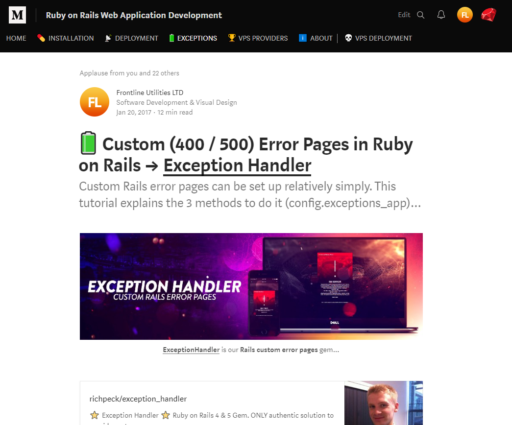

<!-- Intro -->
<div id="intro">
  <h4 align="center"><code><strong><a href="https://www.github.com/richpeck/exception_handler">ExceptionHandler</a></strong></code> is presently the MOST POPULAR exceptions gem for CUSTOM Rails error pages.</h4>
  <p align="center">
    With <strong>180,000+ downloads</strong>, it is the *only* gem to provide <strong>custom 400/500 exception pages for Rails 5 & 6</strong>
  </p>
  <p></p>
  <h5 align="center"><a href="https://github.com/richpeck/exception_handler/releases"><u>0.8.0.0</u></a> (August 2018)</h5>
</div>

<!-- Badges -->
<p align="center">
  <a href="http://badge.fury.io/rb/exception_handler"></a>
  <a href="http://rubygems.org/gems/exception_handler"></a>
  <a href="https://codeclimate.com/github/richpeck/exception_handler"></a>
  <a href='https://coveralls.io/github/richpeck/exception_handler?branch=master'></a>
  <a href="https://travis-ci.org/richpeck/exception_handler"></a>
</p>

<!-- Navigation -->
<div id="navigation">
  <p align="center"></p>
  <p align="center">
    <strong>
      📝 <a href="#introduction">Introduction</a> -
      ⚠️ <a href="#installation">Installation</a> -
      🔧 <a href="#configuration">Configuration</a> -
      ☎️ <a href="#support">Support</a> -
      ⭐ <a href="#changelog">Changelog</a>
    </strong>
  </p>
  <p align="center"></p>
</div>

<!-- Introduction -->
<div id="introduction">
  <h4>📝 Introduction</h4>
</div>

---
<div>
  <p>Rails ships with <u>static HTML error pages</u>:</p>
  <p></p>
  <p>These have an <u>unprofessional</u> appeal. If you are running a Rails app as part of a mission critical offering, you need to ensure it is as congruent as possible. To do this, we created a "custom error pages" solution.</p>
  <p>In 2014, we extracted this into a gem called <U>ExceptionHandler</u>. This gem has become popular thanks to its ease-of-use and ability to integrate with Rails 5.0+. The following explains how it works.</p>
</div>

<!-- Sep -->
<p align="center">
  
</p>

<!-- Installation -->
<div id="installation">
  <h4>⚠️ Installation</h4>
</div>

---

<div>
  <p>
    💎 <u><a href="https://rubygems.org/gems/exception_handler">RubyGems</a></u> |
    💻 <u><a href="https://medium.com/ruby-on-rails-web-application-development/custom-400-500-error-pages-in-ruby-on-rails-exception-handler-3a04975e4677">Medium</a></u> (Tutorial)
  </p>
  <pre><code># Gemfile
gem 'exception_handler', '~> 0.8.0.0'</code></pre>
  <p>Because <u>ExceptionHandler</u> is built around a Rails engine, there is <u>nothing</u> to be done to get it working in production. Installing the Gem <u><i>should</i></u> translate your production 4xx/5xx error pages into dynamic views.</p>
  <p>For environments <u>other</u> than production (development/staging), you will need to set the <code>dev</code> configuration variable to true. This is explained <a href="#dev"><u>further down the page</u></a>.</p>
</div>

<!-- Sep -->
<p align="center">
  
</p>

<!-- configuration -->
<div id="configuration">
  <h4>🔧 Configuration</h4>
</div>

---

<div>
  <p>Due to the nature of the gem, we've integrated a number of configuration options.</p>
  <p>These allow most users to customize it to their requirements - if you have any problems, or requests, you're welcome to <a href="#support"><u>post an issue</u> or <u>ask directly</u></a>.</p>
</div>

---

<p align="center">
   <g-emoji class="g-emoji" alias="file_folder" fallback-src="https://github.githubassets.com/images/icons/emoji/unicode/1f4c1.png">📁</g-emoji> <a href="#config">Config</a>&nbsp;&nbsp;&nbsp;&nbsp;<g-emoji class="g-emoji" alias="computer" fallback-src="https://github.githubassets.com/images/icons/emoji/unicode/1f4bb.png">💻</g-emoji> <a href="#dev" title="Dev Mode">Dev</a>&nbsp;&nbsp;&nbsp;&nbsp;<g-emoji class="g-emoji" alias="floppy_disk" fallback-src="https://github.githubassets.com/images/icons/emoji/unicode/1f4be.png">💾</g-emoji> <a href="#db">Database</a>&nbsp;&nbsp;&nbsp;&nbsp;<g-emoji class="g-emoji" alias="email" fallback-src="https://github.githubassets.com/images/icons/emoji/unicode/2709.png">✉️</g-emoji>   <a href="#email">Email</a>&nbsp;&nbsp;&nbsp;&nbsp;<g-emoji class="g-emoji" alias="eyeglasses" fallback-src="https://github.githubassets.com/images/icons/emoji/unicode/1f453.png">👓</g-emoji> <a href="#views">Views</a>&nbsp;&nbsp;&nbsp;&nbsp;<g-emoji class="g-emoji" alias="speech_balloon" fallback-src="https://github.githubassets.com/images/icons/emoji/unicode/1f4ac.png">💬</g-emoji> <a href="#locales">Locales</a>&nbsp;&nbsp;&nbsp;&nbsp;<g-emoji class="g-emoji" alias="clipboard" fallback-src="https://github.githubassets.com/images/icons/emoji/unicode/1f4cb.png">📋</g-emoji> <a href="#layouts">Layouts</a>&nbsp;&nbsp;&nbsp;&nbsp;<g-emoji class="g-emoji" alias="no_entry" fallback-src="https://github.githubassets.com/images/icons/emoji/unicode/26d4.png">⛔️</g-emoji> <a href="#custom-exceptions">Custom Exceptions</a>
</p>

---

<!-- Config -->
<div id="config">
  <h5>📁 Config</h5>
</div>

The **ONLY** thing you need to manage `ExceptionHandler` is its [`config`](https://github.com/richpeck/exception_handler/blob/master/lib/exception_handler/config.rb) settings.

Whilst the gem **works out of the box** (without any configuration), if you want to manage the [`layouts`](#layouts), [`email`](#email), [`dev`](#dev) or the [`database`](#db), you'll need to set the appropriate values in the config hash.

This is done in `config/application.rb` or `config/environments/[env].rb` ↴

```rb
# config/application.rb

module YourApp
  class Application < Rails::Application

    # => This is an example of ALL available config options
    # => You're able to see exactly how it works here:
    # => https://github.com/richpeck/exception_handler/blob/master/lib/exception_handler/config.rb

    # => Config hash (no initializer required)
    config.exception_handler = {
      dev:        nil, # allows you to turn ExceptionHandler "on" in development
      db:         nil, # allocates a "table name" into which exceptions are saved (defaults to nil)
      email:      nil, # sends exception emails to a listed email (string // "you@email.com")

      # Custom Exceptions
      custom_exceptions: {
        #'ActionController::RoutingError' => :not_found # => example
      },

      # On default 5xx error page, social media links included
      social: {        
        facebook: nil, # Facebook page name   
        twitter:  nil, # Twitter handle  
        youtube:  nil, # Youtube channel name / ID
        linkedin: nil, # LinkedIn name
        fusion:   nil  # FL Fusion handle
      },  

      # This is an entirely NEW structure for the "layouts" area
      # You're able to define layouts, notifications etc ↴

      # All keys interpolated as strings, so you can use symbols, strings or integers where necessary
      exceptions: {

        :all => {
          layout: "exception", # define layout
          notification: true, # (false by default)
          deliver: #something here to control the type of response
        },
        :4xx => {
          layout: nil, # define layout
          notification: true, # (false by default)
          deliver: #something here to control the type of response    
        },    
        :5xx => {
          layout: "exception", # define layout
          notification: true, # (false by default)
          deliver: #something here to control the type of response    
        },
        500 => {
          layout: "exception", # define layout
          notification: true, # (false by default)
          deliver: #something here to control the type of response    
        },

        # This is the old structure
        # Still works but will be deprecated in future versions

        501 => "exception",
        502 => "exception",
        503 => "exception",
        504 => "exception",
        505 => "exception",
        507 => "exception",
        510 => "exception"

      }
    }
  end
end
```  

For a full retinue of the available options, you'll be best looking at the [`config`](https://github.com/richpeck/exception_handler/blob/master/lib/exception_handler/config.rb) file itself.

--

If using an [`engine`](http://guides.rubyonrails.org/engines.html), you **DON'T need an `initializer`**:
```rb
# lib/engine.rb
module YourModule
  class Engine < Rails::Engine

    # => ExceptionHandler
    # => Works in and out of an initializer
    config.exception_handler = {
      dev: nil, # => this will not load the gem in development
      db:  true # => this will use the :errors table to store exceptions
    }
  end
end
```

The best thing about using a `config` options block is that you are able to only define the options that you require.

If you have particular options you *only* wish to run in `staging`, or have single options for `production` etc, this setup gives you the ability to manage it properly...

---

<!-- Dev -->
<div id="dev">
  <h5>💻 Dev</h5>
</div>

As explained, `ExceptionHandler` does *not* work in `development` by default.

This is because it overrides the `exceptions_app` middleware hook - which is *only* invoked in `production` or `staging`.

<p align="center">
  
</p>

To get it working in `development`, you need to override the [`config.consider_all_requests_local`](http://guides.rubyonrails.org/configuring.html#rails-general-configuration) setting (a standard component of Rails) - setting it to "false" ↴

<p align="center">
  
</p>

This is normally done by changing the setting in your Rails config files. However, to make the process simpler for `ExceptionHandler`- we've added a `dev` option which allows you to override the hook through the context of the gem...

```rb
# config/application.rb
config.exception_handler = { dev: true }
```

This disables [`config.consider_all_requests_local`](http://guides.rubyonrails.org/configuring.html#rails-general-configuration), making Rails behave as it would in production.

Whilst simple, it's not recommended for extended use. Very good for testing new ideas etc.

---

<!-- DB -->
<div id="db">
  <h5>💾 DB</h5>
</div>

To save exceptions to your database, you're able to set the `db` option.

Because we use a `controller` to manage the underlying way the system works, we're able to invoke the likes of a [`model`](https://github.com/richpeck/exception_handler/blob/master/app/models/exception_handler/exception.rb) with other functionality.

Ths is done automatically with the latest version of `ExceptionHandler`.

To do this, once you've populated the option with either `true` or a `string`, run `rails db:migrate` from your console.

Our new [`migration system`](https://github.com/richpeck/exception_handler/tree/readme#migrations) will automatically run the migration.

```rb
# config/application.rb
config.exception_handler = { db: true }
```

This enables `ActiveRecord::Base` on the [`Exception`](app/models/exception_handler/exception.rb) class, allowing us to save to the database.

In order for this to work, your db needs the correct table.

---

<!-- Email -->
<div id="email">
  <h5>✉️ Email</h5>
</div>

`ExceptionHandler` also sends **email notifications**.

If you want to receive emails whenever your application raises an error, you can do so by adding your email to the config:

```rb
# config/application.rb
config.exception_handler = {
  email: "your@email.com"
}
```

> **Please Note** this requires [`ActionMailer`](http://guides.rubyonrails.org/action_mailer_basics.html). If you don't have any outbound SMTP server, [`SendGrid`](http://sendgrid.com) is free.

From version [`0.8.0.0`](https://github.com/richpeck/exception_handler/releases/tag/v0.8.0.0), you're able to define whether email notifications are sent on a per-error basis:

```rb
# config/application.rb
config.exception_handlder = {

  # This has to be present for any "notification" declarations to work
  # Defaults to 'false'
  email: "test@test.com",

  # Each status code in the new "exceptions" block allows us to define whether email notifications are sent
  exceptions: {
    :all => { notification: true },
    :50x => { notification: false },
    500 =>  { notification: false }
  }
}
```
---

<!-- Views -->
<div id="views">
  <h5>👓 Views</h5>
</div>

The **views** system in `ExceptionHandler` is modular.

What *most* people want out of the view is to change the way it ***looks***. This can be done without changing the exception "view" itself.

To better explain, if [`ExceptionsController`](https://github.com/richpeck/exception_handler/blob/master/app/controllers/exception_handler/exceptions_controller.rb) is invoked (by `exceptions_app`), it has **ONE** method ([`show`](https://github.com/richpeck/exception_handler/blob/master/app/controllers/exception_handler/exceptions_controller.rb#L42)).

This method calls the [`show` view](https://github.com/richpeck/exception_handler/blob/master/app/views/exception_handler/exceptions/show.html.erb), which is *entirely* dependent on the locales for content & the layout for the look.

This means that if you wish to change how the view "looks" - you're *either* going to want to change your [layout][layouts] or the [*locales*](#locales). There is NO reason to change the `show` view itself - it's succinct and entirely modular. Whilst you're definitely at liberty to change it, you'll just be making the issue more complicated than it needs to be.

--

We've also included a number of routes which shows in [`dev`](dev) mode (allowing you to test):

<p align="center">
  
</p>

---

<!-- Locales -->
<div id="locales">
  <h5>💬 Locales</h5>
</div>

[Locales](https://github.com/richpeck/exception_handler/blob/Readme/config/locales/exception_handler.en.yml) are used to create interchangeable text (translations/internationalization).

-

In `ExceptionHandler`, it provides the wording for each type of error code.

By default, the English name of the error is used (`"404"` will appear as `"Not Found"`) - if you want to create custom messages, you're able to do so by referencing the error's ["status_code"](https://github.com/rack/rack/blob/master/lib/rack/utils.rb#L492) within your locales file:

```yml
# config/locales/en.yml
en:
  exception_handler:
    not_found:              "Your message here" # -> 404 page
    unauthorized:           "You need to login to continue"
    internal_server_error:  "This is a test to show the %{status} of the error"
```

You get access to [`%{message}` and `%{status}`](https://github.com/richpeck/exception_handler/blob/master/app/views/exception_handler/exceptions/show.html.erb#L1), both inferring from an [`@exception`](https://github.com/richpeck/exception_handler/blob/master/app/controllers/exception_handler/exceptions_controller.rb#L20) object we invoke in the controller...

 - `%{message}` is the error's actual message ("XYZ file could not be shown")
 - `%{status}` is the error's status code ("Internal Server Error")

--

By default, only `internal_server_error` is customized by the gem:

```yml
# config/locales/en.yml
en:
  exception_handler:
    internal_server_error: "<strong>%{status} Error</strong> %{message}"
```
---

<!-- Layouts -->
<div id="layouts">
  <h5>📋 Layouts</h5>
</div>

The most attractive feature of `ExceptionHandler` (for most) is its ability to manage [`layouts`](https://guides.rubyonrails.org/layouts_and_rendering.html#structuring-layouts) for HTTP status.

-

The reason for this is due to the way in which Rails works → the "layout" is a "wrapper" for the returned HTML (the "styling" of a page). If you have no layout, it will render the "view" HTML and nothing else.

This means if you want to change the "look" of a Rails action, you simply have to be able to change the `layout`. You should not change the view at all.

To this end, `ExceptionHandler` has been designed around providing a [SINGLE VIEW](app/controllers/exception_handler/exceptions_controller.rb#L44) for exceptions. This view does not need to change (although you're welcome to use a [`generator`][generators] to do so) - the key is the `layout` that's assigned...

- [`4xx`](https://en.wikipedia.org/wiki/List_of_HTTP_status_codes#4xx_Client_errors) errors are given a `nil` layout (by default) (inherits from `ApplicationController` in your main app)
- [`5xx`](https://en.wikipedia.org/wiki/List_of_HTTP_status_codes#5xx_Server_errors) errors are assigned our own [`exception`](app/views/layouts/exception.html.erb) layout:

```rb
# config/application.rb
config.exception_handler = {

  # The new syntax allows us to assign different values to each HTTP status code
  # At the moment, only 'layout' & 'notification' are supported
  # We plan to include several more in the future...

  exceptions: {
    all: { layout: nil } # -> this will inherit from ApplicationController's layout
  }
}
```

The `layout` system has changed between [`0.7.7.0`](releases/tag/v0.7.7.0) and [`0.8.0.0`](releases/tag/v0.8.0.0).

Building on the former's adoption of HTTP status-centric layouts, it is now the case that we have the `all`, `5xx` and `4xx` options - allowing us to manage the layouts for blocks of HTTP errors respectively:

```rb
# config/application.rb
config.exception_handler = {

  # Old (still works)
  # No "all" / "4xx"/"5xx" options
  layouts: {
    500 => 'exception',
    501 => 'exception'
  },

  # New
  exceptions: {
    :all => { layout: 'exception' },
    :4xx => { layout: 'exception' },
    :5xx => { layout: 'exception' }, # -> this overrides the :all declaration
    500  => { layout: nil } # -> this overrides the 5xx declaration
  }
}
```

We've bundled the [`exception`](app/views/layouts/exception.html.erb) layout for `5xx` errors because since these denote internal server errors, it's best to isolate the view system as much as possible. Whilst you're at liberty to change it, we've found it sufficient for most use-cases.

---

<!-- Custom Exceptions -->
<div id="custom-exceptions">
  <h5>⛔️ Custom Exceptions</h5>
</div>

As mentioned, Rails' primary role is to convert Ruby exceptions into HTTP errors.

Part of this process involves mapping Ruby/Rails exceptions to the equivalent HTTP status code.

This is done with [`config.action_dispatch.rescue_responses`](https://github.com/rack/rack/blob/master/lib/rack/utils.rb#L492).

<p align="center">
  
</p>

Whilst this works well, it may be the case that you want to map your own classes to an HTTP status code (default is `Internal Server Error`).

If you wanted to keep this functionality inside `ExceptionHandler`, you're able to do it as follows:

```rb
# config/application.rb
config.exception_handler = {
  custom_exceptions: {
    'CustomClass::Exception' => :not_found
  }
}
```

Alternatively, you're able to still do it with the default Rails behaviour:

```rb
# config/application.rb
config.action_dispatch.rescue_responses = { 'CustomClass::Exception' => :not_found }
```
---

<!-- Generators -->
<div id="generators">
  <h5>💼 Generators</h5>
</div>

If you want to edit the `controller`, `views`, `model` or `assets`, you're able to invoke them in your own application.

This is done - as with other gems - with a single [`generator`](https://github.com/richpeck/exception_handler/blob/master/lib/generators/exception_handler/views_generator.rb) which takes a series of arguments:

    rails g exception_handler:views
    rails g exception_handler:views -v views
    rails g exception_handler:views -v controllers
    rails g exception_handler:views -v models
    rails g exception_handler:views -v assets
    rails g exception_handler:views -v views controllers models assets

If you don't include any switches, this will copy **all** `ExceptionHandler`'s folders put into your app.

Each switch defines which folders you want (EG `-v views` will only copy `views` dir).

---

<!-- Migrations -->
<div id="migrations">
  <h5>✔️ Migrations</h5>
</div>

You **DON'T** need to generate a migration anymore.

From [`0.7.5`](https://github.com/richpeck/exception_handler/releases/tag/0.7.5), the `migration` generator has been removed in favour of our own [migration system](lib/exception_handler/engine.rb#L58).

The reason we did this was so not to pollute your migrations folder with a worthless file. Our migration doesn't need to be changed - we only have to get it into the database and the gem takes care of the rest...

> If you set the [`db`][db] option in config, run `rails db:migrate` and the migration will be run.

To rollback, use the following:

    rails db:migrate:down VERSION=000000

The drawback to this is that if you remove `ExceptionHandler` before you rollback the migration, it won't exist anymore.

You can **only** fire the `rollback` when you have `ExceptionHandler` installed.

<!-- Sep -->
<p align="center">
  
</p>

<!-- Support-->
<div id="support">
  <h4>☎️ Support</h4>
</div>

---

<div>
  <p>You're welcome to contact me directly at <u><a href="mailto:rpeck@frontlineutilities.co.uk"></a><a href="mailto:rpeck@frontlineutilities.co.uk" ref="nofollow">rpeck@frontlineutilities.co.uk</a></u>.</p>
  <p>Alternatively, you may wish to post on our <u><a href="https://github.com/richpeck/exception_handler/issues">GitHub Issues</a></u>, or <u><a href="https://stackoverflow.com/questions/tagged/ruby-on-rails+exceptionhandler" rel="nofollow">StackOverflow</a></u>.</p>
  <p>--</p>
  <p><a href="https://medium.com/ruby-on-rails-web-application-development/custom-400-500-error-pages-in-ruby-on-rails-exception-handler-3a04975e4677" rel="nofollow"></a></p>
</div>

<!-- Sep -->
<p align="center">
  
</p>

<!-- Changelog -->
<div id="changelog">
  <h4>⭐ Changelog</h4>
</div>

---

[**1.0.0.0**](https://github.com/richpeck/exception_handler/releases/tag/v1.0.0.0)
  - [ ] TBA

[**0.8.0.0**](https://github.com/richpeck/exception_handler/releases/tag/v0.8.0.0)
 - [x] [README](https://github.com/richpeck/exception_handler/issues/52) (focus on utility)
 - [x] Introduction of `4xx`,`5xx`,`:all` for layouts config
 - [x] Changed `layouts` to `exceptions` in config    
 - [x] Email improvement
 - [x] Streamlined migration
 - [x] Updated model

[**0.7.7.0**](https://github.com/richpeck/exception_handler/releases/tag/v0.7.7.0)
 - [x] [HTTP status layouts](#layouts)

**0.7.0.0**
 - [x] Wildcard mime types
 - [x] [Custom exceptions](#custom_exceptions)
 - [x] Test suite integration
 - [x] [Model backend](#database)
 - [x] Sprockets 4+
 - [x] New layout
 - [x] Readme / wiki overhaul

**0.6.5.0**
 - [x] Streamlined interface
 - [x] ActiveRecord / Middleware overhaul
 - [x] Supports Sprockets 4+ ([`manifest.js`](http://eileencodes.com/posts/the-sprockets-4-manifest/))
 - [x] Email integration
 - [x] Asset overhaul & improvement
 - [x] Removed dependencies

**0.5.0.0**
 - [x] Locales
 - [x] Email notifications
 - [x] Full test suite
 - [x] Rails 4.2 & Rails 5.0 native ([`request.env`](https://github.com/rails/rails/commit/05934d24aff62d66fc62621aa38dae6456e276be) fix)
 - [x] Controller fixed
 - [x] `DB` fixed
 - [x] Legacy initializer support ([more](https://github.com/richpeck/exception_handler/wiki/1-Setup))
 - [x] Rails asset management improvement
 - [x] Reduced gem file size

**0.4.7.0**
 - [x] New config system
 - [x] Fixed controller layout issues
 - [x] Streamlined middleware
 - [x] New layout & interface

 <!-- Sep -->
 <p align="center">
   
 </p>

 [![404 + 500 Errors][banner]][rubygems]

 <p align="center">
   <strong><a href="https://rubygems.org/gems/exception_handler"><code>ExceptionHandler</code></a> provides custom error pages gem for Rails 5+</strong>
   <br />
   No other gem is as simple or effective at providing branded exception pages in production
 </p>

 <p align="center">
   <a href="http://badge.fury.io/rb/exception_handler"></a>
   <a href="http://rubygems.org/gems/exception_handler"></a>
   <a href="https://codeclimate.com/github/richpeck/exception_handler"></a>
   <a href='https://coveralls.io/github/richpeck/exception_handler?branch=master'></a>
   <a href="https://travis-ci.org/richpeck/exception_handler"></a>
 </p>

 <p align="center">
   <strong>➡️ <a href="https://rubygems.org/gems/exception_handler">Download & Info</a> ⬅️</strong>
 </p>

 <!-- Sep -->
 <p align="center">
   
 </p>

:copyright: <a href="http://www.fl.co.uk" align="absmiddle" ></a> <a href="http://stackoverflow.com/users/1143732/richard-peck?tab=profile" align="absmiddle" ></a> <a href="https://github.com/joehilton" align="absmiddle" ></a> <a href="https://github.com/toymachiner62" align="absmiddle" ></a> <a href="https://github.com/andrewclink" align="absmiddle" ></a> <a href="https://github.com/Startouf" align="absmiddle" ></a> <a href="https://github.com/Tonkonozhenko" align="absmiddle" ></a> <a href="https://github.com/mabako" align="absmiddle" ></a> <a href="https://github.com/frankzhao" align="absmiddle" ></a>


<!-- ################################### -->
<!-- ################################### -->

<!-- Refs -->
<!-- Comments http://stackoverflow.com/a/20885980/1143732 -->
<!-- Images   https://github.com/adam-p/markdown-here/wiki/Markdown-Cheatsheet#images -->

<!-- Images -->
[banner]:readme/banner.jpg

<!-- Links -->
[rubygems]: http://rubygems.org/gems/exception_handler

[10x]: https://en.wikipedia.org/wiki/List_of_HTTP_status_codes#1xx_Informational_responses
[20x]: https://en.wikipedia.org/wiki/List_of_HTTP_status_codes#2xx_Success
[30x]: https://en.wikipedia.org/wiki/List_of_HTTP_status_codes#3xx_Redirection
[40x]: https://en.wikipedia.org/wiki/List_of_HTTP_status_codes#4xx_Client_errors
[50x]: https://en.wikipedia.org/wiki/List_of_HTTP_status_codes#5xx_Server_errors

<!-- Local Links -->
[db]: #db
[email]: #email
[dev]: #dev
[layouts]: #layouts
[locales]: #locales
[configuration]: #configuration
[generators]: #generators
[custom-exceptions]: #custom-exceptions

<!-- ################################### -->
<!-- ################################### -->
