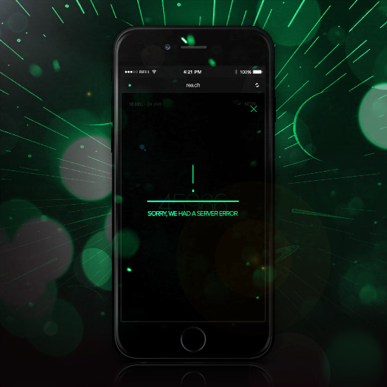

<!-- Intro -->
<div id="intro">
  <h4 align="center"><strong><a href="https://rubygems.org/gems/exception_handler"><code>ExceptionHandler</code></a></strong> is presently the <strong>MOST POPULAR</strong> exceptions gem for <strong><a href="https://medium.com/ruby-on-rails-web-application-development/custom-400-500-error-pages-in-ruby-on-rails-exception-handler-3a04975e4677">Rails CUSTOM error pages</a></strong>...</h4>
  <p align="center">
    With <strong>180,000+ downloads</strong>, it is the *only* gem to provide <strong>custom 400/500 exception pages for Rails 4 + 5</strong>...
  </p>
</div>

<!-- Badges -->
<p align="center">
  <a href="http://badge.fury.io/rb/exception_handler"></a>
  <a href="http://rubygems.org/gems/exception_handler"></a>
  <a href="https://codeclimate.com/github/richpeck/exception_handler"></a>
  <a href='https://coveralls.io/github/richpeck/exception_handler?branch=master'></a>
  <a href="https://travis-ci.org/richpeck/exception_handler"></a>
</p>

<!-- Examples -->
<p align="center">
   
   
</p>

<p align="center">
  Following explains how it works.
  <br/>If you need further support, please feel free to email <a href="mailto:rpeck@frontlineutilities.co.uk">rpeck@frontlineutilities.co.uk</a>...
</p>

<!-- Navigation -->
<div id="navigation">
  <p align="center"></p>
  <p align="center">
    <b>⌚️ <a href="#introduction">Introduction</a> ⌚️</b> - <strong>⚠️ <a href="#installation">Installation</a> ⚠️</strong> - <strong>⚙️ <a href="#configuration">Configuration</a> ⚙️</strong> - <strong>☎️ <a href="#support">Support</a> ☎️</strong> - <strong>⭐ <a href="#changelog">Changelog</a> ⭐</strong>
  </p>
  <p align="center"></p>
</div>

<!-- Introduction -->
<div id="introduction">
  <h4>📝 Introduction</h4>
</div>

---

[`ExceptionHandler`][rubygems] was replaces Rails' [default error pages](https://github.com/rails/rails/tree/ef0b05e78fb0b928c7ef48d3c365dc849af50305/railties/lib/rails/generators/rails/app/templates/public) with dynamic views...

<p align="center">
  <br />
  
  <br/>
  It works by injecting our own <a href="app/controllers/exception_handler/exceptions_controller.rb">controller</a> into the <a href="https://guides.rubyonrails.org/configuring.html#rails-general-configuration"><code>exceptions_app</code></a> middlware hook.
  <br />--<br />
</p>

Rails' default error pages are **static HTML files**.

Whilst there's nothing wrong with these, they will

---

##### 📑 HTTP Error Management

If you're interested in how the system works, the most important thing is that *it doesn't matter* which errors Ruby/Rails raises - they *all* need to be wrapped in a [valid HTTP response](https://www.w3.org/Protocols/rfc2616/rfc2616-sec6.html).

Whilst HTTP has 5 categories of response code, only two are used to denote errors ([`4xx`](https://en.wikipedia.org/wiki/List_of_HTTP_status_codes#4xx_Client_errors) + [`5xx`](https://en.wikipedia.org/wiki/List_of_HTTP_status_codes#5xx_Server_errors)):

<p align="center">
  
</p>

This means that all you're *really* doing is taking "Ruby" errors and giving them an appropriate [HTTP status code](https://en.wikipedia.org/wiki/List_of_HTTP_status_codes) & [message body](https://en.wikipedia.org/wiki/HTTP_message_body) (HTML). Rails handles the process for you - the *only* thing we need to worry about is how the HTML is generated.  

What confuses most is the way in which Rails does this.

The process is handled by [`ActionDispatch::ShowExceptions`](https://github.com/rails/rails/blob/master/actionpack/lib/action_dispatch/middleware/show_exceptions.rb#L44) - middleware which builds a new response out of the erroneous one passed to it by Rails. Through this process, it calls whichever class is present in [`exceptions_app`](http://guides.rubyonrails.org/configuring.html#rails-general-configuration)...

    # show_exceptions.rb
    def render_exception(request, exception)
      backtrace_cleaner = request.get_header "action_dispatch.backtrace_cleaner"
      wrapper = ExceptionWrapper.new(backtrace_cleaner, exception)
      status  = wrapper.status_code
      request.set_header "action_dispatch.exception", wrapper.exception
      request.set_header "action_dispatch.original_path", request.path_info
      request.path_info = "/#{status}"
      response = @exceptions_app.call(request.env) #-> this is where the HTML is generated
      response[1]["X-Cascade"] == "pass" ? pass_response(status) : response
    rescue Exception => failsafe_error
      $stderr.puts "Error during failsafe response: #{failsafe_error}\n  #{failsafe_error.backtrace * "\n  "}"
      FAILSAFE_RESPONSE
    end

In other words, what a user *sees* (in the browser) has very little to do with the error Rails experienced.

`ExceptionHandler` doesn't change this behaviour - it simply *adds* our own controller/view to provide the HTML...

---

##### ⛔️ Middleware-Powered Exceptions

The key with `ExceptionHandler` lies in its integration with the [Rack middleware stack](https://guides.rubyonrails.org/rails_on_rack.html#internal-middleware-stack).

Most other "exception" gems rely on hacking the core Rails system, our gem works *with* Rails to provide a valid set of HTML...

<p align="center">
  
</p>


Point is that by tapping into the `exceptions_app` middleware hook, the application is able to provide users with the ability to manage the way the system works without having to worry about whether the system is going to work with other gems etc.

The fact that it doesn't change the underlying exception handling process, or use any hacks, makes it extremely potent for production.


The following shows how...

<!-- Sep -->
<p align="center">
  
</p>

<!-- Installation -->
<div id="installation">
  <h4>⚠️ Installation</h4>
</div>

---

    # Gem
    gem install exception_handler


    # Gemfile
    gem `exception_handler`, '~> 0.8.0.0'

The gem is available on [RubyGems][rubygems] and is fully compatible with Rails 4 + 5.

Installation works by overriding the `exceptions_app` hook - which means that it is *always* present in production.

**You have to do NOTHING to get it working in production.** Just install the gem and it will provide custom 400/500 exception pages. The `4xx` pages will use your app's standard layout, `5xx` has its own [custom layout][layouts]. Both can be [customized][configuration].

To get it working in development, we've included a [`dev`][dev] mode, which overrides the `consider_all_requests_local` option inside Rails. This is consequential; the core of the gem is robust and works on 1,000's of apps which have graciously chosen to run it.

<!-- Sep -->
<p align="center">
  
</p>

<!-- configuration -->
<div id="configuration">
  <h4>⚙️ Configuration</h4>
</div>

----

<p align="center">
   1. <a href="#config">🚧 Config</a>&nbsp;&nbsp;&nbsp;&nbsp;2. <a href="#dev" title="Dev Mode">💻 Dev</a>&nbsp;&nbsp;&nbsp;&nbsp;3. <a href="#db">💾 Database</a>&nbsp;&nbsp;&nbsp;&nbsp;4. <a href="#email">✉️   Email</a>&nbsp;&nbsp;&nbsp;&nbsp;5. <a href="#views">👓 Views</a>&nbsp;&nbsp;&nbsp;&nbsp;6. <a href="#locales">💬 Locales</a>&nbsp;&nbsp;&nbsp;&nbsp;7. <a href="#custom-exceptions">⛔️ Custom Exceptions</a>&nbsp;&nbsp;&nbsp;&nbsp;8. <a href="#generators">💼 Generators</a>
</p>

----

<!-- Config -->
<div id="config">
  <h5>🚧 Config</h5>
</div>

The ONLY thing you need to configure `ExceptionHandler` is its [`config`](https://github.com/richpeck/exception_handler/blob/master/lib/exception_handler/config.rb) settings.

Whilst the gem **works out of the box** (without any configuration), if you want to manage the [`layouts`](#layouts), [`email`](#email), [`dev`](#dev) or the [`database`](#db), you'll need to set the appropriate values in the config hash.

This is done in `config/application.rb` or `config/environments/[env].rb` ↴

```
# config/application.rb

module YourApp
  class Application < Rails::Application

    # => This is an example of ALL available config options
    # => You're able to see exactly how it works here:
    # => https://github.com/richpeck/exception_handler/blob/master/lib/exception_handler/config.rb

    # => Config hash (no initializer required)
    config.exception_handler = {
      dev:        nil, # allows you to turn ExceptionHandler "on" in development
      db:         nil, # allocates a "table name" into which exceptions are saved (defaults to nil)
      email:      nil, # sends exception emails to a listed email (string // "you@email.com")

      # On default 5xx error page, social media links included
      social: {        
        facebook: nil, # Facebook page name   
        twitter:  nil, # Twitter handle  
        youtube:  nil, # Youtube channel name / ID
        linkedin: nil, # LinkedIn name
        fusion:   nil  # FL Fusion handle
      },  

      # This is an entirely NEW structure for the "layouts" area
      # You're able to define layouts, notifications etc ↴

      # All keys interpolated as strings, so you can use symbols, strings or integers where necessary
      exceptions: {

        :all => {
          layout: "exception", # define layout
          notification: true, # (false by default)
          deliver: #something here to control the type of response
        },
        :4xx => {
          layout: nil, # define layout
          notification: true, # (false by default)
          deliver: #something here to control the type of response    
        },    
        :5xx => {
          layout: "exception", # define layout
          notification: true, # (false by default)
          deliver: #something here to control the type of response    
        },
        500 => {
          layout: "exception", # define layout
          notification: true, # (false by default)
          deliver: #something here to control the type of response    
        },

        # This is the old structure
        # Still works but will be deprecated in future versions

        501 => "exception",
        502 => "exception",
        503 => "exception",
        504 => "exception",
        505 => "exception",
        507 => "exception",
        510 => "exception"

      }
    }

  end
end
```  

For a full retinue of the available options, you'll be best looking at the [`config`](https://github.com/richpeck/exception_handler/blob/master/lib/exception_handler/config.rb) file itself.

--

If using an [`engine`](http://guides.rubyonrails.org/engines.html), you **DON'T need an `initializer`**:

    # lib/engine.rb
    module YourModule
      class Engine < Rails::Engine

        # => ExceptionHandler
        # => Works in and out of an initializer
        config.exception_handler = {
          dev: nil, # => this will not load the gem in development
          db:  true # => this will use the :errors table to store exceptions
        }
      end

    end

The best thing about using a `config` options block is that you are able to only define the options that you require.

If you have particular options you *only* wish to run in `staging`, or have single options for `production` etc, this setup gives you the ability to manage it properly...

---

<!-- Dev -->
<div id="dev">
  <h5>💻 Dev</h5>
</div>

As explained, `ExceptionHandler` does *not* work in `development` by default.

This is because it overrides the `exceptions_app` middleware hook - which is *only* invoked in `production` or `staging`...

<p align="center">
  
</p>

To get it working in `development`, you need to override the [`config.consider_all_requests_local`](http://guides.rubyonrails.org/configuring.html#rails-general-configuration) setting (a standard component of Rails) - setting it to "false" ↴

<p align="center">
  
</p>

This is normally done by changing the setting in your Rails config files. However, to make the process simpler for `ExceptionHandler`- we've added a `dev` option which allows you to override the hook through the context of the gem...

```
# config/application.rb
config.exception_handler = { dev: true }
```

This disables [`config.consider_all_requests_local`](http://guides.rubyonrails.org/configuring.html#rails-general-configuration), making Rails behave as it would in production.

Whilst simple, it's not recommended for extended use. Very good for testing new ideas etc.

---

<!-- DB -->
<div id="db">
  <h5>💾 DB</h5>
</div>

If you want to save exceptions to your database, you will need to migrate a new table.

Ths is done automatically with the latest version of `ExceptionHandler`.

To do this, once you've enabled the option, run `rails db:migrate` from your console. Our new [`migration system`](https://github.com/richpeck/exception_handler/tree/readme#migrations) will automatically run the migration.

```
# config/application.rb
config.exception_handler = { db: true }
```

This enables `ActiveRecord::Base` on the [`Exception`](app/models/exception_handler/exception.rb) class, allowing us to save to the database.

In order for this to work, your db needs the correct table.

---

<!-- Email -->
<div id="email">
  <h5>✉️ Email</h5>
</div>

`ExceptionHandler` also sends email notifications.

If you want to receive emails whenever your application raises an error, you can do so by adding your email to the config:

    # config/application.rb
    config.exception_handler = {
      email: "your@email.com"
    }

> **Please Note** this requires [`ActionMailer`](http://guides.rubyonrails.org/action_mailer_basics.html). If you don't have any outbound SMTP server, [`SendGrid`](http://sendgrid.com) is free.

From version `0.8.0.0`, you're able to define whether email notifications are sent on a per-error basis:

    # config/application.rb
    config.exception_handlder = {
      exceptions: {
        :all => { notification: true },
        500 =>  { notification: false }
      }
    }

[Full tutorial here](https://github.com/richpeck/exception_handler/wiki/2-Email)

---

<!-- Views -->
<div id="views">
  <h5>👓 Views</h5>
</div>

The **views** system in `ExceptionHandler` is modular.

What *most* people want out of the view is to change the way it ***looks***. This can be done without changing the exception "view" itself...

<p align="center">
  
</p>

To better explain, if [`ExceptionsController`](https://github.com/richpeck/exception_handler/blob/0.8/app/controllers/exception_handler/exceptions_controller.rb) is invoked (by `exceptions_app`), it has **ONE** method ([`show`](https://github.com/richpeck/exception_handler/blob/0.8/app/controllers/exception_handler/exceptions_controller.rb#L42)). This method calls the [`show` view](https://github.com/richpeck/exception_handler/blob/0.8/app/views/exception_handler/exceptions/show.html.erb), which is *entirely* dependent on the locales for content & the layout for the look.

This means that if you wish to change how the view "looks" - you're *either* going to want to change your *layouts* or the [*locales*](#locales). There is NO reason to change the `show` view itself - it's succinct and entirely modular. Whilst you're definitely at liberty to change it, you'll just be making the issue more complicated than it needs to be.

-

If you wish to change the "layout" / "look", there are **two** options...

 * Firstly, you can create your own layout. This is done by changing the

 * Secondly,

---

<!-- Locales -->
<div id="locales">
  <h5>💬 Locales</h5>
</div>

Locales are used to denote interchangeable text (for different languages).

We've used it for a different purpose - to provide text for our "show" view. The beauty of this is that 1) It's entirely modular & 2) It's extensible (we are able to use as many locales as required)...

[[ locales ]]


The `ExceptionHandler` view is populated by [`@exception.description`](app/models/exception_handler/exception.rb#L121), which pulls from the `locales`.

If you want custom messages, you need the following. The key is defined by the HTTP [`status_code`](https://github.com/rack/rack/blob/1.5.2/lib/rack/utils.rb#L544)

    # config/locales/en.yml
    en:
      exception_handler:
        not_found: "Your message here"
        unauthorized: "You need to login to continue"
        internal_server_error: "This is a test to show the %{status} of the error"

You get access to `%{message}` and `%{status}`, both inferring from `@exception`.

---

<!-- Layouts -->
<div id="layouts">
  <h5>📋 Layouts</h5>
</div>

![Layout][layout_img]

If you want to change the various layouts, you need to use the [`config`](#config) to set them.

![Layout][layouts_img]

By default, `5xx` errors are shown with our [`exception` layout][layout] - this can be overridden by changing the `config` to use a layout of your choice. If you want to inherit the `ApplicationController` layout, assign the codes to `nil`.

---

<!-- Custom Exceptions -->
<div id="custom-exceptions">
  <h5>⛔️ Custom Exceptions</h5>
</div>

**Custom Exceptions also supported in [`0.7.5`](https://github.com/richpeck/exception_handler/releases/tag/0.7.5)**

Rails handles this for us - [**`config.action_dispatch.rescue_responses`**][rescue_responses]  ↴

![ActionDispatch][config.action_dispatch.rescue_responses]

You need to add to the `rescue_responses` hash in your app's config (mapped to [`status codes`](https://github.com/rack/rack/blob/1.5.2/lib/rack/utils.rb#L544)):

    # config/application.rb
    config.action_dispatch.rescue_responses["ActionController::YourError"] = :bad_request

Because `HTTP` can only process `4xx` / `5xx` errors, if `Rails` raises an exception, it needs to assign one of the error status codes. **Default** is [`internal_server_error`](https://github.com/rack/rack/blob/1.5.2/lib/rack/utils.rb#L595) - if you'd prefer your app to just return `500` errors for your custom exception, you don't need to explicitly declare them.

---

<!-- Generators -->
<div id="generators">
  <h5>💼 Generators</h5>
</div>

**You can generate `ExceptionHandler` into your own application.**

[[ Generator ]]

The following commands will copy the directories...

    rails g exception_handler:views
    rails g exception_handler:views -v views
    rails g exception_handler:views -v controllers
    rails g exception_handler:views -v models
    rails g exception_handler:views -v assets
    rails g exception_handler:views -v views controllers models assets

If you don't include any switches, this will copy **all** the folders put into your app.

Each switch defines which folders you want (EG `-v views` will only copy `views` dir).

---

<!-- Migrations -->
<div id="migrations">
  <h5>✔️ Migrations</h5>
</div>

**You *DON'T* need to generate a migration any more**.

From [`0.7.5`](https://github.com/richpeck/exception_handler/releases/tag/0.7.5), the `migration` generator has been removed in favour of our own [migration system](lib/exception_handler/engine.rb#L58).

The reason we did this was so not to pollute your migrations folder with a worthless file. Our migration doesn't need to be changed - we only have to get it into the database and the gem takes care of the rest...

> If you set the `db` option in config, run `rails db:migrate` and the migration will be run.

To rollback, use the following:

    rails db:migrate:down VERSION=000000

The drawback to this is that if you remove `ExceptionHandler` before you rollback the migration, it won't exist anymore. You can **only** fire the `rollback` when you have `ExceptionHandler` installed.

<!-- Sep -->
<p align="center">
  
</p>

<!-- Support -->
<div id="support">
  <h4>☎️ Support</h4>
</div>

---

You're welcome to contact me directly at <a href="mailto:rpeck@frontlineutilities.co.uk">rpeck@frontlineutilities.co.uk</a>.

Alternatively, you may wish to post on our [Github Issues](https://github.com/richpeck/exception_handler/issues), or [StackOverflow](https://stackoverflow.com/questions/tagged/ruby-on-rails+exceptionhandler).

Responses typically delivered within several hours.

<!-- Sep -->
<p align="center">
  
</p>

<!-- Changelog -->
<div id="changelog">
  <h4>⭐ Changelog</h4>
</div>

---

[**1.0.0.0**](https://github.com/richpeck/exception_handler/releases/tag/v1.0.0.0)
  - [ ] TBA

[**0.8.0.0**](https://github.com/richpeck/exception_handler/releases/tag/v0.8.0.0)
 - [x] [README](https://github.com/richpeck/exception_handler/issues/52) (focus on utility)
 - [x] Introduction of `4xx`,`5xx`,`:all` for layouts config
 - [x] Changed `layouts` to `exceptions` in config    
 - [x] Email improvement
 - [x] Streamlined migration
 - [x] Updated model

[**0.7.7.0**](https://github.com/richpeck/exception_handler/releases/tag/v0.7.7.0)
 - [x] [HTTP status layouts](#layouts)

**0.7.0.0**
 - [x] Wildcard mime types
 - [x] [Custom exceptions](#custom_exceptions)
 - [x] Test suite integration
 - [x] [Model backend](#database)
 - [x] Sprockets 4+
 - [x] New layout
 - [x] Readme / wiki overhaul

**0.6.5.0**
 - [x] Streamlined interface
 - [x] ActiveRecord / Middleware overhaul
 - [x] Supports Sprockets 4+ ([`manifest.js`](http://eileencodes.com/posts/the-sprockets-4-manifest/))
 - [x] Email integration
 - [x] Asset overhaul & improvement
 - [x] Removed dependencies

**0.5.0.0**
 - [x] Locales
 - [x] Email notifications
 - [x] Full test suite
 - [x] Rails 4.2 & Rails 5.0 native ([`request.env`](https://github.com/rails/rails/commit/05934d24aff62d66fc62621aa38dae6456e276be) fix)
 - [x] Controller fixed
 - [x] `DB` fixed
 - [x] Legacy initializer support ([more](https://github.com/richpeck/exception_handler/wiki/1-Setup))
 - [x] Rails asset management improvement
 - [x] Reduced gem file size

**0.4.7.0**
 - [x] New config system
 - [x] Fixed controller layout issues
 - [x] Streamlined middleware
 - [x] New layout & interface

 <!-- Sep -->
 <p align="center">
   
 </p>

 [![404 + 500 Errors][banner]][rubygems]

 <p align="center">
   <strong><a href="https://rubygems.org/gems/exception_handler"><code>ExceptionHandler</code></a> provides custom error pages gem for Rails 4 & 5...</strong>
   <br />
   No other gem is as simple or effective at providing branded exception pages in production
 </p>

 <p align="center">
   <a href="http://badge.fury.io/rb/exception_handler"></a>
   <a href="http://rubygems.org/gems/exception_handler"></a>
   <a href="https://codeclimate.com/github/richpeck/exception_handler"></a>
   <a href='https://coveralls.io/github/richpeck/exception_handler?branch=master'></a>
   <a href="https://travis-ci.org/richpeck/exception_handler"></a>
 </p>

 <p align="center">
   <strong>➡️ <a href="https://rubygems.org/gems/exception_handler">Download & Info</a> ⬅️</strong>
 </p>

 <!-- Sep -->
 <p align="center">
   
 </p>

:copyright: <a href="http://www.fl.co.uk" align="absmiddle" ></a> <a href="http://stackoverflow.com/users/1143732/richard-peck?tab=profile" align="absmiddle" ></a> <a href="https://github.com/joehilton" align="absmiddle" ></a> <a href="https://github.com/toymachiner62" align="absmiddle" ></a> <a href="https://github.com/andrewclink" align="absmiddle" ></a> <a href="https://github.com/Startouf" align="absmiddle" ></a> <a href="https://github.com/Tonkonozhenko" align="absmiddle" ></a> <a href="https://github.com/mabako" align="absmiddle" ></a> <a href="https://github.com/frankzhao" align="absmiddle" ></a>


<!-- ################################### -->
<!-- ################################### -->

<!-- Refs -->
<!-- Comments http://stackoverflow.com/a/20885980/1143732 -->
<!-- Images   https://github.com/adam-p/markdown-here/wiki/Markdown-Cheatsheet#images -->

<!-- Images -->
[banner]:readme/banner.jpg

<!-- Links -->
[rubygems]: http://rubygems.org/gems/exception_handler

[10x]: https://en.wikipedia.org/wiki/List_of_HTTP_status_codes#1xx_Informational_responses
[20x]: https://en.wikipedia.org/wiki/List_of_HTTP_status_codes#2xx_Success
[30x]: https://en.wikipedia.org/wiki/List_of_HTTP_status_codes#3xx_Redirection
[40x]: https://en.wikipedia.org/wiki/List_of_HTTP_status_codes#4xx_Client_errors
[50x]: https://en.wikipedia.org/wiki/List_of_HTTP_status_codes#5xx_Server_errors

<!-- Local Links -->
[db]: #db
[email]: #email
[dev]: #dev
[layouts]: #layouts
[locales]: #locales
[configuration]: #configuration

<!-- ################################### -->
<!-- ################################### -->
